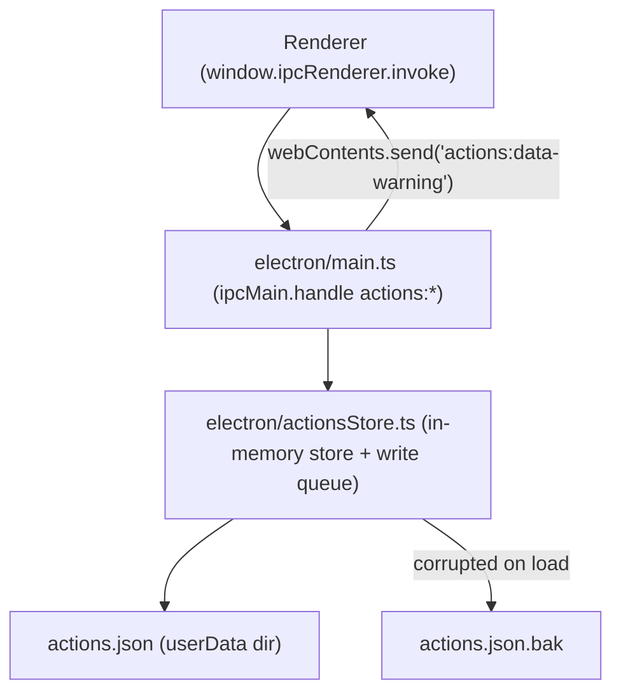

# F01. Actions Data Store — Technical Specification

## 1. Technical Overview

**What:** A main-process-only persistence layer for Cronos's "actions" (the saved automation sequences). It owns a single JSON file inside Electron's `userData` directory, loads it into an in-memory store on startup, exposes four IPC channels (`actions:list`, `actions:get`, `actions:save`, `actions:delete`) for the renderer to read and mutate that store, and guarantees writes are atomic and serialized so a crash or a race between two saves can never corrupt previously saved data.

**Why:** Every other feature in this PRD (F02–F08) reads or writes action records through this store — there is no database, no backend server, and no existing persistence code anywhere in the app (`electron/main.ts` currently only reads OS state: installed apps, displays, icons). F01 has to establish the schema, the IPC contract shape, and the failure-handling conventions that all six downstream features will rely on, so getting the record shape and the atomic-write/error-result contracts right here avoids rework later. Because the renderer's `preload.ts` exposes only a generic `window.ipcRenderer.invoke(channel, ...args)` bridge (no per-channel typed wrapper), F01 must follow that same raw-channel-string pattern rather than introducing a new abstraction.

**Scope:** Included — the JSON file schema for an action and its steps, the in-memory store and its startup load (including first-run and corrupted-file handling), atomic write-to-temp-then-rename logic, a write queue that serializes concurrent saves/deletes, and the four IPC handlers registered in `electron/main.ts`. Excluded — any renderer UI that calls these channels (main screen list, wizard forms, execution engine) belongs to F02–F08; this spec only guarantees the data contract and main-process behavior those features will build against.

## 2. Architecture Impact

**Affected components:**

- `electron/actionsStore.ts` (new) — schema types, file I/O, atomic write, write queue, CRUD logic, in-memory cache.
- `electron/main.ts` (modified) — registers the four `actions:*` IPC handlers, initializes the store during startup, pushes a one-off corrupted-data warning event to the renderer.
- `%APPDATA%/cronos/actions.json` (new, runtime-created) — the persisted data file, inside `app.getPath('userData')`.
- `%APPDATA%/cronos/actions.json.bak` (new, runtime-created only on corruption) — preserved copy of a corrupted file, never overwritten silently by normal saves.



No renderer/frontend files are introduced or modified by F01 — the renderer-side consumers (list rendering, wizard forms, execution) are built in F02–F08 against the contract defined here.

## 3. Technical Decisions

| Decision | Chosen Approach | Alternative Considered | Trade-off |
|---|---|---|---|
| In-memory store lifecycle | Load `actions.json` once during `app.whenReady()`, hold parsed actions in a module-level variable in `actionsStore.ts`, update it in place after every successful write | Re-read the file from disk on every `actions:list`/`actions:get` call | Matches the PRD's explicit "holds the parsed actions in memory... refreshed on every write" requirement and avoids redundant disk I/O on every list render; requires discipline to keep the in-memory copy and on-disk copy in sync, which the write queue guarantees |
| Write serialization | Hand-rolled promise chain inside `actionsStore.ts` (`enqueueWrite` appends onto a single running promise) | Add a queue dependency (e.g. `p-queue`) | Zero new dependencies, consistent with the codebase's existing preference for Node built-ins only (`electron/main.ts` uses only `node:fs`, `node:os`, `node:path`, `node:crypto`, `node:child_process`); a hand-rolled chain is sufficient because there is only ever one writer process |
| ID generation | `crypto.randomUUID()`, already imported and used in `electron/main.ts` for temp-file naming | Add a `uuid` npm package | Reuses a built-in already proven in this codebase; no new dependency |
| Atomic write mechanism | Write full JSON to a uniquely-named temp file in the same directory (`actions.json.tmp-<uuid>`), then `fs.renameSync` it over `actions.json` | Write directly to `actions.json` | Same-volume, same-directory rename is atomic on NTFS, so a crash mid-write can never leave `actions.json` half-written; the random suffix avoids any collision even though the write queue already prevents concurrent writers |
| Corrupted-file signaling to renderer | A one-off `win.webContents.send('actions:data-warning', message)` push after startup load, mirroring the existing unsolicited-push pattern already in `electron/main.ts` (`win.webContents.send('main-process-message', ...)` on `did-finish-load`) | Bundle a warning flag inside the `actions:list` response shape | Keeps `actions:list`'s response a plain `Action[]` (simple, matches every other list-style channel in the app like `apps:list`/`displays:list`), and reuses an established push-event precedent instead of inventing a new response envelope |
| `id` / `createdAt` ownership | Main process assigns `id` and `createdAt` when a save request omits them (create path) and preserves both when present and matching an existing record (edit path) | Renderer generates `id` before calling `actions:save` | Consistent with "owned and read/written exclusively by the main process"; avoids depending on renderer-side UUID generation for data that must be unique across the store the main process itself owns |

### Assumptions / Decisions (PRD gaps filled via Auto-Accept policy)

- **`createdAt` field added to the schema.** The PRD's F01 field list (Section 6) does not mention a timestamp, but F02's Capabilities explicitly requires the actions list to be "sorted by most recently created first," which is impossible without one. Added `createdAt` (ISO 8601 string, set once at creation, never changed on edit) as the minimal field needed to satisfy that downstream requirement.
- **Field naming/casing.** No JSON schema is specified in the PRD beyond field names in prose. Used `camelCase` for every field, matching every existing interface in `electron/main.ts` and `src/App.tsx` (`iconPath`, `displayBounds`, etc.).
- **Temp-file naming convention.** PRD says only "write to a temp file, then rename." Chose `actions.json.tmp-<uuid>` in the same directory as `actions.json`, following the existing temp-file pattern in `electron/main.ts`'s `resolveShortcutTargets` (`cronos-shortcuts-in-${randomUUID()}.json`).
- **`.bak` overwrite behavior.** PRD says a corrupted file "is renamed with a `.bak` suffix instead of being overwritten immediately." Not specified: what happens if a `.bak` already exists from a previous corruption. Decision: the new corrupted file overwrites any existing `actions.json.bak` (only the most recent corrupted snapshot is kept) — preserving every historical corruption indefinitely is not a stated requirement and would leak disk space silently.
- **`actions:save` request shape for create vs. edit.** PRD lists `actions:save` as a single channel without specifying how create and edit are distinguished. Decision: a single upsert-style request — the payload omits `id`/`createdAt` for create (main assigns both) and includes the existing `id` for edit (main preserves `createdAt`, replaces the rest). If an edit payload's `id` does not match any stored record, it is treated as a validation error (`"action not found"`) rather than silently created, to avoid masking a renderer-side bug.
- **Validation ownership and failure shape.** PRD's Error Handling block only covers write/IO failures explicitly, not field-constraint validation (name length, delay range, step count/type). Decision: `actionsStore.ts` validates every field constraint listed in PRD Section 6 Capabilities before attempting any write, and returns the same `{ success: false, error }` failure shape used for IO failures — so callers (F05) have one failure contract to handle regardless of cause.
- **Test framework.** No test runner exists in `package.json`. Decision: add `vitest` as a devDependency rather than relying on Node's built-in `node:test` runner, because Electron 30 bundles a Node version that does not reliably support native TypeScript execution (`--experimental-strip-types` is Node 22+), while `vitest` reuses the project's existing Vite toolchain with no additional build config. This is the one new dependency introduced by F01.

## 4. Component Overview

**Backend (Electron main process):**

| File Path | New/Modified | Purpose | Key Responsibilities |
|---|---|---|---|
| `electron/actionsStore.ts` | New | Core persistence module for actions | Defines `Action`/`Step` types and per-field validation; loads/initializes the in-memory store on startup (first-run and corrupted-file handling); implements atomic write-to-temp-then-rename; implements the write queue serializing all saves/deletes; implements `listActions`, `getAction`, `saveAction`, `deleteAction` |
| `electron/main.ts` | Modified | Wires the store into the app lifecycle | Calls the store's startup-load function inside `app.whenReady()` before/alongside `createWindow()`; registers `ipcMain.handle` for `actions:list`, `actions:get`, `actions:save`, `actions:delete`; pushes `actions:data-warning` to the renderer once, only when startup load detected a corrupted file |

**Persistence (JSON file store):**

| File Path | New/Modified | Purpose | Key Responsibilities |
|---|---|---|---|
| `actions.json` (inside `app.getPath('userData')`) | New (runtime-created) | The persisted array of all saved actions | Created empty on first run; overwritten only via the atomic temp-file-then-rename sequence; never partially written |
| `actions.json.bak` (inside `app.getPath('userData')`) | New (runtime-created, conditional) | Snapshot of a corrupted file, kept instead of destroyed | Written once per detected corruption event, overwriting any prior `.bak` |

**Frontend:** None. F01 introduces no renderer-visible UI or renderer source files; `src/App.tsx` and future F02–F08 renderer code will call the channels documented in Section 5 directly via `window.ipcRenderer.invoke(...)`, following the existing pattern already used for `apps:list`/`displays:list`.

## 5. API Contracts

All four channels follow the existing project convention: no typed preload wrapper — the renderer calls `window.ipcRenderer.invoke("<channel>", ...args)` with the channel name as a string literal, exactly like the existing `apps:list`/`apps:open`/`displays:list` calls in `src/App.tsx`.

### Channel: List Actions

- **Channel:** `actions:list`
- **Direction:** Renderer → Main (`invoke`)

**Request:** No arguments.

**Request Example:**

```json
{}
```

**Response (success):** `Action[]` — the full in-memory store, in insertion order (renderer sorts for display as needed, per F02).

**Response Example:**

```json
[
  {
    "id": "3f2e1a70-9b34-4c3e-8f10-2f6b0e1a9c21",
    "name": "Preencher relatório",
    "monitorId": 1,
    "monitorBounds": { "x": 0, "y": 0, "width": 1920, "height": 1080 },
    "targetApp": {
      "name": "Notepad",
      "path": "C:\\Users\\leand\\AppData\\Roaming\\Microsoft\\Windows\\Start Menu\\Programs\\Notepad.lnk",
      "iconPath": "C:\\Windows\\System32\\notepad.exe"
    },
    "defaultDelaySeconds": 2,
    "steps": [
      { "id": "8a1b...", "type": "click", "position": { "x": 512, "y": 340 } },
      { "id": "9c2d...", "type": "wait", "seconds": 3 }
    ],
    "createdAt": "2026-09-12T14:32:00.000Z"
  }
]
```

**Error Codes:** None — a read of the in-memory store cannot fail; an empty array is returned when the store is empty (first run or all actions deleted).

### Channel: Get Single Action

- **Channel:** `actions:get`
- **Direction:** Renderer → Main (`invoke`)

**Request:**

| Field | Type | Required | Validation | Description |
|---|---|---|---|---|
| `id` (1st positional arg) | `string` | Yes | non-empty | The action's UUID |

**Request Example:**

```json
{ "id": "3f2e1a70-9b34-4c3e-8f10-2f6b0e1a9c21" }
```

**Response (success):** The matching `Action` object, or `null` if no action with that `id` exists in the store.

**Response Example:**

```json
{
  "id": "3f2e1a70-9b34-4c3e-8f10-2f6b0e1a9c21",
  "name": "Preencher relatório",
  "monitorId": 1,
  "monitorBounds": { "x": 0, "y": 0, "width": 1920, "height": 1080 },
  "targetApp": { "name": "Notepad", "path": "C:\\...\\Notepad.lnk", "iconPath": "C:\\Windows\\System32\\notepad.exe" },
  "defaultDelaySeconds": 2,
  "steps": [],
  "createdAt": "2026-09-12T14:32:00.000Z"
}
```

**Error Codes:** None — an unknown `id` returns `null`, not a thrown error.

### Channel: Save Action (create or edit)

- **Channel:** `actions:save`
- **Direction:** Renderer → Main (`invoke`)

**Request:**

| Field | Type | Required | Validation | Description |
|---|---|---|---|---|
| `id` (in payload) | `string` | No (omit for create) | must match an existing record when present | Present only when editing an existing action |
| `name` | `string` | Yes | 1-60 chars after trim | Action display name |
| `monitorId` | `number` | Yes | must be a currently detected monitor id | Target monitor, always recorded even with 1 monitor |
| `monitorBounds` | `object {x,y,width,height}` | Yes | all numbers | Target monitor's bounds at save time |
| `targetApp` | `object {name,path,iconPath}` | Yes | all non-empty strings | Target application reference |
| `defaultDelaySeconds` | `number` | Yes | 0.5-30 | Delay applied between steps |
| `steps` | `array` | Yes | 0-50 entries, each matching a step schema below | Ordered step list |

**Step schemas (each item in `steps`):**

| `type` | Additional fields | Validation |
|---|---|---|
| `click` | `position: {x:number, y:number}` | coordinates relative to the monitor's origin |
| `auto-type` | `position: {x:number, y:number}`, `text: string` | `text` 1-500 chars |
| `press-key` | `key: string`, `modifiers: string[]` | `modifiers` subset of `["ctrl","alt","shift"]` |
| `wait` | `seconds: number` | integer, 1-60 |
| `manual-type` | `label: string`, `placeholder?: string` | `label` 1-40 chars, `placeholder` up to 100 chars |

**Request Example (create):**

```json
{
  "name": "Preencher relatório",
  "monitorId": 1,
  "monitorBounds": { "x": 0, "y": 0, "width": 1920, "height": 1080 },
  "targetApp": { "name": "Notepad", "path": "C:\\...\\Notepad.lnk", "iconPath": "C:\\Windows\\System32\\notepad.exe" },
  "defaultDelaySeconds": 2,
  "steps": [
    { "id": "8a1b...", "type": "click", "position": { "x": 512, "y": 340 } },
    { "id": "9c2d...", "type": "auto-type", "position": { "x": 512, "y": 380 }, "text": "relatorio_final" }
  ]
}
```

**Response (success):**

| Field | Type | Description |
|---|---|---|
| `success` | `boolean` | Always `true` |
| `action` | `Action` | The persisted record, including the assigned/preserved `id` and `createdAt` |

**Response Example (success):**

```json
{
  "success": true,
  "action": {
    "id": "3f2e1a70-9b34-4c3e-8f10-2f6b0e1a9c21",
    "name": "Preencher relatório",
    "monitorId": 1,
    "monitorBounds": { "x": 0, "y": 0, "width": 1920, "height": 1080 },
    "targetApp": { "name": "Notepad", "path": "C:\\...\\Notepad.lnk", "iconPath": "C:\\Windows\\System32\\notepad.exe" },
    "defaultDelaySeconds": 2,
    "steps": [
      { "id": "8a1b...", "type": "click", "position": { "x": 512, "y": 340 } },
      { "id": "9c2d...", "type": "auto-type", "position": { "x": 512, "y": 380 }, "text": "relatorio_final" }
    ],
    "createdAt": "2026-09-12T14:32:00.000Z"
  }
}
```

**Response (failure):**

```json
{ "success": false, "error": "O nome da ação deve ter entre 1 e 60 caracteres." }
```

**Error Codes:**

| Code (in `error` message content, not a numeric code — see note) | Description |
|---|---|
| Validation failure | Any field-constraint violation listed above; nothing is written |
| `"action not found"` | Payload includes an `id` that does not match any stored record |
| IO failure | Temp-file write or rename fails (disk full, permission denied); in-memory store and on-disk file remain exactly as before the call |

Note: because this is a pure IPC contract (no HTTP layer), failures are communicated via `success: false` plus a human-readable `error` string intended for direct display in the caller's error toast, rather than a numeric HTTP-style code.

### Channel: Delete Action

- **Channel:** `actions:delete`
- **Direction:** Renderer → Main (`invoke`)

**Request:**

| Field | Type | Required | Validation | Description |
|---|---|---|---|---|
| `id` (1st positional arg) | `string` | Yes | must match an existing record | The action's UUID to delete |

**Request Example:**

```json
{ "id": "3f2e1a70-9b34-4c3e-8f10-2f6b0e1a9c21" }
```

**Response (success):**

```json
{ "success": true }
```

**Response (failure):**

```json
{ "success": false, "error": "Não foi possível excluir a ação. Tente novamente." }
```

**Error Codes:**

| Condition | Description |
|---|---|
| Unknown `id` | Failure result, nothing removed |
| IO failure | Temp-file write or rename fails; the action remains in the in-memory store and on disk, unchanged |

### Push Event: Corrupted-Data Warning

- **Channel:** `actions:data-warning`
- **Direction:** Main → Renderer (`webContents.send`, consumed via `window.ipcRenderer.on("actions:data-warning", handler)`)
- **Fires:** At most once per app launch, only when the startup load detected an unreadable/invalid `actions.json`.

**Payload Example:**

```json
"Não foi possível carregar suas ações salvas. Um novo arquivo será criado ao salvar a próxima ação."
```

## 6. Data Model

This feature persists a single JSON array in `actions.json`, not a SQL table. Field types, constraints, and nesting are described below in place of column/index/migration tables.

### Record: `Action`

| Field | Type | Required | Constraints | Description |
|---|---|---|---|---|
| `id` | `string` | Yes | UUID v4, unique across the store, immutable after creation | Assigned by the main process via `crypto.randomUUID()` on create |
| `name` | `string` | Yes | 1-60 characters, trimmed of leading/trailing whitespace | Display name |
| `monitorId` | `number` | Yes | matches a `displays:list` entry's `id` at capture time | Target monitor, always recorded even with 1 monitor detected |
| `monitorBounds` | `object` | Yes | `{ x: number, y: number, width: number, height: number }` | Target monitor's bounds at the time of save |
| `targetApp` | `object` | Yes | `{ name: string, path: string, iconPath: string }`, all non-empty | Target application reference, mirrors the existing `AppInfo` shape |
| `defaultDelaySeconds` | `number` | Yes | 0.5-30, default 2 | Delay applied between every consecutive pair of steps during execution |
| `steps` | `Step[]` | Yes | 0-50 entries (Save is disabled below 1 by F05, but the store itself does not reject exactly 0 to keep validation concerns in one place — see note below) | Ordered step list |
| `createdAt` | `string` | Yes | ISO 8601 timestamp, set once on create, never modified on edit | Used by F02 to sort the list by most recently created first |

> Note: the PRD's F05 UX rule ("Save button disabled until ≥1 step") is a renderer-side gate. `actionsStore.ts` still enforces the hard ceiling of 50 steps and per-step schema validity on every save, as the last line of defense, but does not duplicate the ≥1-step UX rule as a hard store-level rejection, since a future feature may legitimately need to persist a 0-step draft (e.g., autosave) without that being treated as store corruption. This is a deliberate scope boundary, not a gap.

### Record: `Step` (discriminated union on `type`)

| Field | Type | Present on | Constraints | Description |
|---|---|---|---|---|
| `id` | `string` | all | UUID v4, unique within the action | Assigned on step creation |
| `type` | `"click" \| "auto-type" \| "press-key" \| "wait" \| "manual-type"` | all | one of the 5 literals | Step kind |
| `position` | `object { x: number, y: number }` | `click`, `auto-type` | coordinates relative to `monitorBounds` origin (not absolute screen coordinates), so a captured position stays valid if the monitor's absolute OS position changes but its resolution/DPI does not | Captured via F04 |
| `text` | `string` | `auto-type` | 1-500 characters | Pre-set text typed on every run |
| `key` | `string` | `press-key` | one of the predefined key list (Enter, Tab, Esc, Backspace, Delete, Espaço, arrows, Home, End, Page Up/Down) | Simulated key |
| `modifiers` | `string[]` | `press-key` | subset of `["ctrl","alt","shift"]`, may be empty | Simulated modifier keys |
| `seconds` | `number` | `wait` | integer, 1-60 | Additional pause beyond the default delay |
| `label` | `string` | `manual-type` | 1-40 characters | Field label shown at execution time (F07) |
| `placeholder` | `string` | `manual-type`, optional | up to 100 characters | Field placeholder shown at execution time (F07) |

### File-level shape

`actions.json` contains a single top-level JSON array of `Action` objects — no wrapper object, no metadata envelope. This keeps the on-disk format identical to the `actions:list` response shape, minimizing translation logic.

```json
[
  { "id": "...", "name": "...", "...": "..." },
  { "id": "...", "name": "...", "...": "..." }
]
```

**Cross-process notes:**

- Every field name uses `camelCase`, matching the existing `AppInfo`/`DisplayBounds`/`DisplayInfo` interfaces already defined (separately, per the project's current no-shared-types-module convention) in `electron/main.ts` and `src/App.tsx`.
- `Action`/`Step` types are defined once, in `electron/actionsStore.ts`, and imported by `electron/main.ts` — this single-source-of-truth boundary is kept within the main process only; renderer-side code in F02+ is expected to declare its own local mirror interfaces when needed, consistent with how `src/App.tsx` already locally redeclares `AppInfo`/`DisplayBounds` rather than importing them from `electron/main.ts`.

## 7. Testing Strategy

No test framework currently exists in this repository. F01 introduces `vitest` as a devDependency (see Section 3 Assumptions) to unit- and integration-test the store module, since it is pure logic with no Electron window/UI involved and can run in a Node test environment.

| Test File | Test Type | Target | Coverage Goal |
|---|---|---|---|
| `electron/actionsStore.test.ts` | Unit | `actionsStore.ts` load/save/delete/validation logic | High coverage of every branch in the Error Handling section below |
| `electron/actionsIpc.test.ts` | Integration | The registered `ipcMain.handle` callback functions and the startup `actions:data-warning` push | Exercises the handlers as the renderer would call them, without a real renderer process |

**`electron/actionsStore.test.ts` functions:**

| Test Function | Description | Assertions |
|---|---|---|
| `test_loadStore_createsEmptyFileOnFirstRun` | No `actions.json` exists yet | Store initializes with an empty array; `actions.json` is created on disk; no exception thrown (PRD acceptance criterion) |
| `test_loadStore_readsExistingValidFile` | `actions.json` pre-populated with valid records | In-memory store exactly matches the file's parsed contents |
| `test_loadStore_corruptedJson_startsEmptyAndBacksUpFile` | `actions.json` contains invalid JSON | Store initializes empty; original file is renamed to `actions.json.bak`; no exception thrown (PRD acceptance criterion) |
| `test_loadStore_corruptedJson_setsDataWarningFlag` | Same corrupted-file setup | The load result signals the corrupted-data condition so `main.ts` can push `actions:data-warning` |
| `test_saveAction_createAssignsIdAndCreatedAt` | Save a payload with no `id` | Result includes a generated UUID `id` and an ISO `createdAt`; both are persisted to disk |
| `test_saveAction_editPreservesIdAndCreatedAt` | Save an existing `id` with changed fields | `id` and `createdAt` are unchanged; other fields reflect the update |
| `test_saveAction_persistsAcrossReload` | Save, then re-run the load routine against the same file (simulating a restart) | The saved action is present after reload (PRD acceptance criterion) |
| `test_saveAction_singleMonitorStoresMonitorIdAndBounds` | Save with only 1 monitor available | `monitorId` and `monitorBounds` are present and correct in the persisted record (PRD acceptance criterion) |
| `test_saveAction_validationRejectsInvalidName` | Save with an empty or 61+ character name | `{ success: false, error }` returned; nothing written to disk or memory |
| `test_saveAction_validationRejectsStepCountOver50` | Save with 51 steps | `{ success: false, error }` returned; nothing written |
| `test_saveAction_validationRejectsUnknownEditId` | Save with an `id` not present in the store | `{ success: false, error: "action not found" }` |
| `test_saveAction_writeFailureLeavesPreviousStateIntact` | Force the rename step to throw (mocked `fs.rename`) | `{ success: false, error }` returned; in-memory store and on-disk file remain exactly as before the call (PRD acceptance criterion) |
| `test_saveAction_concurrentWritesSerializeWithoutCorruption` | Fire two `saveAction` calls concurrently | Both complete; the file is valid JSON afterward containing both changes applied in order; no partial/interleaved write occurs (PRD acceptance criterion for concurrent races) |
| `test_deleteAction_removesFromStoreAndFile` | Delete an existing `id` | Action absent from in-memory store and from the persisted file |
| `test_deleteAction_unknownIdReturnsFailure` | Delete a non-existent `id` | `{ success: false, error }` returned; store unchanged |
| `test_listActions_returnsFullInMemoryArray` | Call list after several saves/deletes | Returned array matches current in-memory state exactly |
| `test_getAction_returnsNullForUnknownId` | Get a non-existent `id` | Returns `null`, does not throw |

**`electron/actionsIpc.test.ts` functions:**

| Test Function | Description | Assertions |
|---|---|---|
| `test_actionsListHandler_returnsStoreContents` | Invoke the `actions:list` handler directly | Response matches `listActions()` output |
| `test_actionsGetHandler_returnsMatchingAction` | Invoke `actions:get` with a known id | Response matches the stored record |
| `test_actionsSaveHandler_returnsSuccessResultShape` | Invoke `actions:save` with a valid payload | Response shape matches the documented `{ success, action }` contract |
| `test_actionsDeleteHandler_returnsSuccessResultShape` | Invoke `actions:delete` with a known id | Response shape matches the documented `{ success }` contract |
| `test_startup_corruptedFile_pushesDataWarningMessage` | Start up against a corrupted `actions.json` | `webContents.send` is called once with `"actions:data-warning"` and the exact PRD toast text |

**Cross-feature integration tests** (F01's side of the contracts other features depend on, per PRD Section 9 "Cross-Feature Integration"):

| Test Function | Description | Assertions |
|---|---|---|
| `test_integration_savedActionExposesNameAppAndStepCountForListing` | Save an action, then list | The listed record carries exactly the `name`, `targetApp.name`, and `steps.length` needed for F02's row rendering |
| `test_integration_getActionReturnsExactRecordForEditPrefill` | Save an action, then get it by id | Every field (`name`, `monitorId`, `monitorBounds`, `targetApp`) matches what was saved, for F03's pre-fill |
| `test_integration_editRoundTripsStepsAndDefaultDelayExactly` | Save an action with steps and a non-default delay, reload, re-save with one field changed | `steps` and `defaultDelaySeconds` from before the edit are loaded unchanged into the edit flow, per F05's requirement |
| `test_integration_clickStepCoordinateRoundTripsExactly` | Save a `click` step with a specific `position`, then get it back | The returned `position` is bit-for-bit identical, for F08's execution to click the exact recorded spot |
| `test_integration_targetAppAndMonitorRoundTripExactlyForCaptureAndExecution` | Save an action with a specific `targetApp`/`monitorId`/`monitorBounds` | The stored values are exactly what a caller reading via `actions:get` would pass on to F04 capture or F08 execution |
| `test_integration_stepListDeterminesManualFieldsPresence` | Save actions with and without `manual-type` steps | A caller can determine from the stored `steps` array alone whether F07's manual-fields screen should show |
| `test_integration_deleteRemovesActionFromSubsequentList` | Save two actions, delete one, then list | Only the remaining action appears, confirming F06's delete is visible to F02's list immediately |
