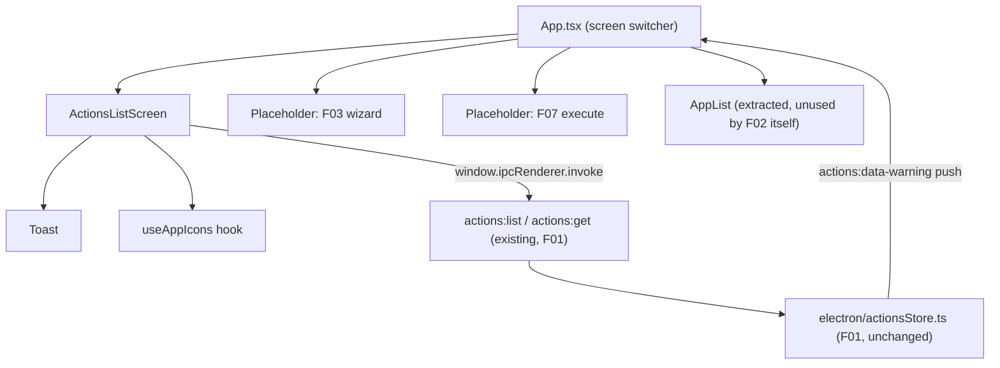

# F02. Main Screen — Actions List — Technical Specification

## 1. Technical Overview

**What:** The renderer-side "home" screen of Cronos: a list of every saved action (name, target app, step count), sorted most-recent-first, with a name-based search/filter input, an always-visible "Adicionar ação" button, per-row edit/delete icon buttons, an empty state, and a bottom-center success/error toast. It also introduces the app's first screen-switching mechanism in `src/App.tsx`, since today the renderer has exactly one view (the installed-app browser built in the previous main-structure commit) and no navigation concept at all.

**Why:** F02 is the first renderer feature built on top of F01's persistence layer, and per the PRD's Wave plan it ships two full waves before F03 (Basic Info), F06 (Delete), and F07 (Manual Fields) exist. Those three features are exactly what F02's rows must navigate to (edit → F03, delete icon → F06's confirmation flow, row click → F07). Because none of them exist yet, this spec has to define a navigation contract that F02 can fully implement and test today, and that F03/F06/F07 can plug real screens into later without changing F02's code. The codebase also has no router library and no renderer test setup at all (`package.json` has no `react-router-dom`, no `@testing-library/*`, no jsdom) — both gaps are closed here, minimally, following the existing "no unnecessary dependencies" convention already established by F01 (hand-rolled write queue instead of a queue library, `crypto.randomUUID()` instead of the `uuid` package).

**Scope:** Included — the actions list screen itself (fetch, sort, search/filter, empty state, row rendering with icon/name/step-count, row-click/edit/delete affordances), extraction of three pieces of logic that already exist inline in `src/App.tsx` (the toast, the icon-fetch worker pool, and the installed-app browser itself) into reusable pieces so F02 and future features share them instead of duplicating them, the `src/App.tsx` screen-switch contract that F02's navigation plugs into, and the corrupted-data warning toast (`actions:data-warning`, pushed by F01's main process but never consumed by any renderer code yet). Excluded — the real Add/Edit wizard (F03), the real delete confirmation dialog and deletion call (F06), and the real execute/manual-fields flow (F07/F08); F02 renders minimal placeholder surfaces at those three navigation targets (see Section 3) so every F02 acceptance criterion about "navigates to X" is genuinely observable and testable this wave, without pre-building those features' UI ahead of their own specs.

## 2. Architecture Impact

**Affected components:**

- `src/App.tsx` (modified) — becomes the root screen switcher: owns the `Screen` union state, the pending-toast hand-off, the corrupted-data warning listener, and renders `ActionsListScreen` plus placeholder surfaces for F03/F06/F07 targets.
- `src/screens/ActionsListScreen.tsx` (new) — the F02 screen itself.
- `src/components/AppList.tsx` (new) — extraction of the installed-app browser currently inline in `App.tsx`, unchanged behavior, so F03's app selector (PRD: "reuses the existing installed-app listing, with the same search/filter behavior") has a component to reuse later.
- `src/components/Toast.tsx` (new) — extraction of the bottom-center auto-dismiss toast currently inline in `App.tsx`, reused by `ActionsListScreen` and `AppList`.
- `src/hooks/useAppIcons.ts` (new) — extraction of the concurrency-limited icon-fetch worker pool currently inline in `App.tsx`, reused by `AppList` and `ActionsListScreen` (rows need each action's target-app icon).
- No `electron/` files are touched — F02 consumes only the `actions:list` and `actions:get` channels F01 already exposes; no new IPC channel is introduced.



## 3. Technical Decisions

| Decision | Chosen Approach | Alternative Considered | Trade-off |
|---|---|---|---|
| Navigation mechanism | A hand-rolled `Screen` discriminated-union state in `App.tsx` (`{kind:"actions-list"}` \| `{kind:"execute", actionId}` \| `{kind:"wizard", mode, actionId?}`) with plain setState-based navigation functions | Add `react-router-dom` | The renderer has exactly one screen today and zero URL/deep-link requirements anywhere in the PRD; a router is unjustified weight. Matches F01's "no new dependency unless the stack forces it" precedent. |
| F03/F06/F07 targets before they exist | `App.tsx` renders a small inline `PlaceholderScreen` component for the `wizard`/`execute` screens, and `ActionsListScreen` renders a local placeholder confirmation surface for delete — none of them call any mutating IPC or claim to be the real feature | Skip building navigation until F03/F06/F07 exist; or fully hand-build stand-ins for their real UI now | Every F02 acceptance criterion that says "navigates to X screen" needs an observable transition to test today. Building real F06 dialog copy/behavior now risks conflicting with F06's own future spec; a clearly-labeled stub avoids that while still proving the transition fires with the right payload (action id, and full record for edit). |
| Success-toast hand-off across screens | `App.tsx` exposes a single `returnToList(toastMessage?: string)` function passed to every screen (including the placeholders); it stores the message in a `pendingToast` state, switches `screen` back to `actions-list`, and passes `pendingToast` as `initialToast` prop to `ActionsListScreen`, which displays it once via `Toast` and clears it | Global event bus / context provider for toasts | The PRD only ever shows a toast "after returning to the main screen" — there is exactly one consumer (`ActionsListScreen`) and one producer path (returning), so a single passed-down callback is simpler than an app-wide pub/sub and needs no new dependency |
| Reusing the search/filter pattern (PRD requirement) | Copy the exact `useState` + `useMemo` case-insensitive substring-match pattern already in `App.tsx`'s `filteredApps`, applied to action names | Extract a shared `useFilteredList` hook | The existing pattern is 4 lines and used in exactly two places after this change; PRD only asks for "the same filtering pattern," not a shared abstraction. Over-extracting a one-purpose hook adds a layer with no second real caller yet. |
| Icon loading for rows | Extract the existing worker-pool-with-cache logic (`ICON_FETCH_CONCURRENCY` workers pulling from a shared index, results in a module-level `Map`) into `src/hooks/useAppIcons.ts`, parameterized by the list of icon paths to load | Duplicate the inline logic a second time in `ActionsListScreen` | The exact same logic is now needed in two places (`AppList` rows and action rows); duplicating a ~25-line worker pool a second time is the kind of copy the extraction step exists to avoid, and the hook's inputs/outputs are simple enough that extraction doesn't add real complexity |
| Renderer-side `Action` typing | `ActionsListScreen` declares a local, minimal `ActionSummary` interface (`id`, `name`, `createdAt`, `targetApp: {name, iconPath}`, `steps: unknown[]`) rather than importing the full `Action`/`Step` union from `electron/actionsStore.ts` | Share `Action`/`Step` types via a common module imported by both processes | Matches F01 spec's stated convention ("renderer-side code in F02+ is expected to declare its own local mirror interfaces... consistent with how `src/App.tsx` already locally redeclares `AppInfo`/`DisplayBounds`"). F02 only ever reads `name`, `targetApp.name`, `targetApp.iconPath`, `steps.length`, and `createdAt` — it never inspects a step's internal shape — so a minimal local interface is both sufficient and safer against unrelated `Step` schema changes |
| Renderer test setup (none exists yet) | Add `@testing-library/react`, `@testing-library/jest-dom`, `@testing-library/user-event`, and `jsdom` as devDependencies; each new renderer test file opts into jsdom per-file via the `// @vitest-environment jsdom` pragma comment, with no changes to `vite.config.ts` | Add a global Vitest `environment: 'jsdom'` + `setupFiles` in `vite.config.ts` | The existing `electron/*.test.ts` suite relies on the default `node` environment and mocks `electron` at the module level; forcing a global `jsdom` environment risks subtly changing how those existing tests run. The per-file pragma isolates the new environment to exactly the new renderer test files, touching zero existing configuration |

### Assumptions / Decisions (PRD gaps filled via Auto-Accept policy)

- **Placeholder screens for F03 (wizard), F06 (delete confirmation), and F07 (execute)**, as detailed in the Technical Decisions table above — the single largest open decision this spec had to make, since the PRD describes F02's navigation targets in terms of features that literally do not exist in the codebase yet (confirmed by Wave 3 in PRD Section 8 running after this Wave 2 spec). Documented here so the user can review the placeholder contract before F03/F06/F07 are spec'd.
- **"Edit or execute" full-record consumption (PRD Section 6 Consumes says F02 consumes "full action record when an edit or execute is triggered," but Provides lists the full record only for editing, not execution).** Interpreted as: F02 itself calls `actions:get` and forwards the full record only on the edit path (`onEdit(id, action)`); on the execute path it forwards only the id (`onExecute(id)`), since F07's own PRD Consumes block already lists "F01: saved action's step list" directly — F07 is expected to fetch its own copy rather than receive it secondhand through F02. This keeps F02 from doing a redundant fetch that F07 will repeat anyway.
- **Empty-state "highlight" of the Adicionar ação button** (PRD: "highlights the 'Adicionar ação' button," no further detail). Implemented as a second, larger copy of the same action rendered inside the empty-state message block (in addition to the always-visible top button), using the `Button` component's default (primary) variant — not a new visual treatment, just a second call-to-action so the empty state is not just static text.
- **Row step-count copy.** PRD example is "6 passos" (plural). Applied standard pt-BR singular/plural: "1 passo" for exactly one step, "N passos" otherwise, including "0 passos" for a saved-but-stepless record (the data store's Data Model note confirms 0-step records are not rejected at the storage layer, only gated by F05's Save button).
- **Sort tie-breaking.** PRD says "most recently created first" using `createdAt` (an ISO string added by F01 for exactly this purpose). Not specified: two actions created in the same millisecond. Decision: stable sort by `createdAt` descending as the sole key; a tie keeps the pre-sort (array/insertion) order, which is an acceptable, unnoticeable edge case at manual-creation speed.
- **Search behavior.** PRD says "narrows the list by action name," reusing the app-list pattern. That pattern trims and lowercases the query and does a substring match (not a prefix or fuzzy match); applied identically here with no additional decision needed since the codebase pattern already answers it.
- **Icon fallback when a target app's icon can't be loaded.** No PRD detail. Reused the exact existing fallback already in `AppList`: a generic `lucide-react` `AppWindow` icon in place of a missing/failed icon load.
- **New test dependencies** (`@testing-library/react`, `@testing-library/jest-dom`, `@testing-library/user-event`, `jsdom`), per the Technical Decisions table — the first renderer-side tests in this codebase.

## 4. Component Overview

**Frontend:**

| File Path | New/Modified | Purpose | Key Responsibilities |
|---|---|---|---|
| `src/App.tsx` | Modified | Root screen switcher | Owns `Screen` union state and `pendingToast`; renders `ActionsListScreen` by default; renders placeholder surfaces for the `wizard`/`execute` screens; subscribes to the `actions:data-warning` push once on mount and surfaces it as a toast on the list screen; exposes `returnToList`, `goToCreateWizard`, `goToEditWizard`, `goToExecute` to children |
| `src/screens/ActionsListScreen.tsx` | New | F02's main screen | Fetches `actions:list` on mount and on return-with-refresh; sorts by `createdAt` desc; renders search input, "Adicionar ação" button, empty state, and the row list; per row renders name/app-name/app-icon/step-count plus row-click, edit-icon, and delete-icon affordances; owns the local `deleteRequest` placeholder state; renders `initialToast` once via `Toast` |
| `src/components/AppList.tsx` | New (extracted) | Reusable installed-app browser | Exact behavior currently inline in `App.tsx` (list/search/open/focus/display-select for installed apps), relocated so F03's future app selector can reuse it; no behavior change |
| `src/components/Toast.tsx` | New (extracted) | Shared bottom-center toast | Accepts a `message: string \| null` and auto-dismiss duration (default 2500ms per PRD's F02 Experience block); identical visual/timing behavior to the inline toast it replaces |
| `src/hooks/useAppIcons.ts` | New (extracted) | Shared icon loader | Given a list of `{key, iconPath}` entries, loads each icon via `apps:icon` through a concurrency-limited worker pool into a shared `Map` cache, exposing a lookup function and a re-render tick; identical logic to the inline version it replaces |

**Backend:** None — F02 introduces no changes to `electron/`. It consumes the existing `actions:list` and `actions:get` IPC channels exactly as F01 documented them.

**Database:** None — no schema or persisted-field changes.

## 5. API Contracts (Consumed — no new channels introduced by F02)

F02 calls two channels already implemented and documented by F01 (`docs/F01-actions-data-store/spec.md` Section 5); they are restated here only to the extent F02 depends on their shape, per the PRD → SPEC mapping for Consumes.

### Channel: List Actions (consumed on screen mount and on refresh-after-return)

- **Channel:** `actions:list`
- **Direction:** Renderer → Main (`invoke`)
- **Called by:** `ActionsListScreen`, with no arguments.

**Response used by F02 (subset of fields actually read):**

```json
[
  {
    "id": "3f2e1a70-9b34-4c3e-8f10-2f6b0e1a9c21",
    "name": "Preencher relatório",
    "targetApp": { "name": "Notepad", "iconPath": "C:\\Windows\\System32\\notepad.exe" },
    "steps": [{ "type": "click" }, { "type": "wait" }],
    "createdAt": "2026-09-12T14:32:00.000Z"
  }
]
```

`ActionsListScreen` reads `id`, `name`, `targetApp.name`, `targetApp.iconPath`, `steps.length`, and `createdAt` only (see Section 3, "Renderer-side `Action` typing").

**Error Codes:** None (matches F01: a read of the in-memory store cannot fail).

### Channel: Get Single Action (consumed only when the edit icon is clicked)

- **Channel:** `actions:get`
- **Direction:** Renderer → Main (`invoke`)
- **Called by:** `ActionsListScreen`, with the row's `id`, only on edit-icon click.

**Request Example:**

```json
{ "id": "3f2e1a70-9b34-4c3e-8f10-2f6b0e1a9c21" }
```

**Response:** The full `Action` record as defined by F01 (opaque to F02 beyond passing it through `onEdit(id, action)` to `App.tsx`, which forwards it to the future F03 wizard placeholder/screen).

**Error Codes:** None (unknown `id` returns `null`, which cannot occur here since the id comes from a row already rendered from `actions:list`).

### Push Event consumed: Corrupted-Data Warning

- **Channel:** `actions:data-warning`
- **Direction:** Main → Renderer, already pushed unconditionally on startup by `electron/main.ts` when F01 detects a corrupted file; never consumed by any renderer code before this feature.
- **Handled by:** `App.tsx`, via `window.ipcRenderer.on("actions:data-warning", handler)` registered once; the message is forwarded into the same `pendingToast` mechanism used for the create/edit/delete/execute success toasts, so it surfaces identically on `ActionsListScreen`.

## 6. Data Model

F02 persists nothing and adds no fields to F01's schema. This section documents the renderer-side view-model shapes introduced instead of a database table.

### View type: `ActionSummary` (local to `src/screens/ActionsListScreen.tsx`)

| Field | Type | Source | Description |
|---|---|---|---|
| `id` | `string` | `actions:list` | Row identity, forwarded on every navigation callback |
| `name` | `string` | `actions:list` | Displayed name; also the search/filter key |
| `targetApp.name` | `string` | `actions:list` | Displayed app name |
| `targetApp.iconPath` | `string` | `actions:list` | Looked up via `useAppIcons` for the row icon |
| `steps` | `unknown[]` | `actions:list` | Only `.length` is read, for the step-count label |
| `createdAt` | `string` (ISO 8601) | `actions:list` | Sort key, descending |

### View type: `Screen` (local to `src/App.tsx`)

| Variant | Fields | Meaning |
|---|---|---|
| `{ kind: "actions-list" }` | — | Default/home screen (F02) |
| `{ kind: "wizard"; mode: "create" }` | — | Placeholder target for "Adicionar ação" (future F03) |
| `{ kind: "wizard"; mode: "edit"; actionId: string; action: Action }` | `actionId`, full `action` record | Placeholder target for the edit icon (future F03), carries the pre-fetched record |
| `{ kind: "execute"; actionId: string }` | `actionId` | Placeholder target for row-click (future F07) |

### View type: `DeleteRequest` (local to `src/screens/ActionsListScreen.tsx`)

| Field | Type | Description |
|---|---|---|
| `id` | `string` | Action targeted by the delete icon |
| `name` | `string` | Shown in the placeholder confirmation surface's copy |

No indexes, constraints, or migrations apply — all three types are ephemeral, in-memory React state.

## 7. Testing Strategy

No renderer test file exists in this repository yet (`electron/*.test.ts` only). F02 adds the first renderer tests, using `@testing-library/react` + `jsdom` per the Technical Decisions table.

| Test File | Test Type | Target | Coverage Goal |
|---|---|---|---|
| `src/screens/ActionsListScreen.test.tsx` | Unit/Component | `ActionsListScreen` | Every acceptance criterion in PRD Section 9 for F02, plus empty state, search, sort, icon fallback |
| `src/App.test.tsx` | Integration | Screen-switch contract + toast hand-off | Navigation callbacks fire with correct payloads; `pendingToast` round-trips correctly; corrupted-data warning surfaces once |
| `src/components/Toast.test.tsx` | Unit | `Toast` | Renders message, auto-dismisses after 2500ms, renders nothing when `message` is `null` |

**`src/screens/ActionsListScreen.test.tsx` functions:**

| Test Function | Description | Assertions |
|---|---|---|
| `test_list_rendersNameAppAndStepCountPerRow` | Mock `actions:list` returning 2 actions with different step counts | Each row shows name, target app name, and correctly pluralized step count (PRD acceptance criterion) |
| `test_list_sortsByCreatedAtDescending` | Mock 3 actions with distinct `createdAt` values, out of order | Rendered row order is most-recent-first |
| `test_list_emptyState_showsMessageAndHighlightedCta` | Mock `actions:list` returning `[]` | "Nenhuma ação criada ainda." is shown; a second "Adicionar ação" call-to-action is rendered in the empty state |
| `test_search_filtersByNameCaseInsensitiveSubstring` | Type a partial, mixed-case query into the search input | Only matching rows remain, matching the same predicate used by `AppList` |
| `test_rowClick_onNonIconArea_invokesOnExecuteWithId` | Click the row body (not the icon buttons) | `onExecute` is called with that row's id (PRD acceptance criterion) |
| `test_editIcon_fetchesFullRecordAndInvokesOnEditWithIt` | Click a row's edit icon | `actions:get` is invoked with that id; `onEdit` is called with `(id, fullActionRecord)` (PRD acceptance criterion) |
| `test_deleteIcon_opensPlaceholderConfirmationNamingTheAction` | Click a row's delete icon | A confirmation surface appears containing that action's exact name; no `actions:delete` call is made |
| `test_addButton_alwaysVisible_invokesOnCreate` | Render with and without actions present | The top "Adicionar ação" button is present in both cases and calls `onCreate` when clicked (PRD acceptance criterion) |
| `test_initialToast_rendersOnceThenClears` | Mount with `initialToast="Ação 'X' criada com sucesso."` | Toast is shown immediately; a re-render/remount does not reshow it (PRD acceptance criterion: toast after returning from create/edit/delete/execution) |
| `test_iconLoadFailure_fallsBackToGenericAppIcon` | Mock `apps:icon` to resolve `null` for a row's icon path | The generic `AppWindow` icon renders instead of a broken image |

**`src/App.test.tsx` functions:**

| Test Function | Description | Assertions |
|---|---|---|
| `test_default_rendersActionsListScreen` | Initial mount | `ActionsListScreen` is the rendered screen (PRD acceptance criterion: this is the home screen) |
| `test_onCreate_switchesToWizardCreateScreen` | Trigger `onCreate` from the list | Placeholder wizard-create screen renders (PRD acceptance criterion: "Adicionar ação" navigates to the wizard, Step 1) |
| `test_onEdit_switchesToWizardEditScreenWithRecord` | Trigger `onEdit(id, action)` from the list | Placeholder wizard-edit screen renders, carrying the exact `action` record passed in (PRD acceptance criterion: edit icon navigates pre-filled) |
| `test_onExecute_switchesToExecuteScreenWithId` | Trigger `onExecute(id)` from the list | Placeholder execute screen renders with that id |
| `test_returnToList_withMessage_showsToastOnce` | From a placeholder screen, call `returnToList("Ação excluída com sucesso.")` | Switches back to `ActionsListScreen` with that exact message shown once |
| `test_corruptedDataWarning_surfacesAsToastOnList` | Fire a mocked `actions:data-warning` IPC event after mount | The exact F01 warning message is shown as a toast on the list screen |

**Cross-feature integration tests** (F02's side of the PRD Section 9 "Cross-Feature Integration" bullets that name F02):

| Test Function | Description | Assertions |
|---|---|---|
| `test_integration_actionPersistedByF01AppearsInListWithCorrectFields` | Seed the mocked `actions:list` response with a record shaped exactly like a real F01/F05 save (name, targetApp, steps, createdAt) | The row renders that exact name, target app name, and step count — the same fields F03/F05 would have written through F01 |
| `test_integration_editForwardsExactStoredRecordForF03Prefill` | Mock `actions:get` to return a full record with every field F03 will need to pre-fill (name, monitorId, monitorBounds, targetApp) | `onEdit` receives that record completely unmodified, so a future F03 pre-fill is exact |
| `test_integration_listRefreshesAfterReturnSoDeletedActionIsGone` | Render the list with 2 actions, simulate `returnToList()` after a mocked deletion where the second `actions:list` call omits one action | The removed action no longer appears in the rendered list (PRD cross-feature criterion: F06 deletion is reflected in F02's list) |
