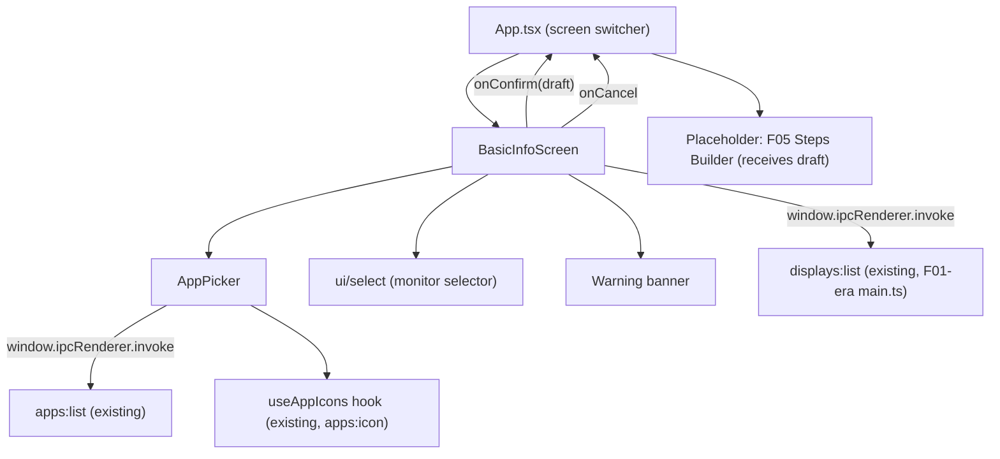

# F03. Add/Edit Action — Basic Info — Technical Specification

## 1. Technical Overview

**What:** The first real screen of the Add/Edit Action wizard: a name field, a conditionally-shown monitor selector, and a searchable single-select installed-app picker, used both to start a brand-new action and to edit an existing one. It replaces the inert `wizard` placeholder that `src/App.tsx` currently renders (built by F02 purely to make navigation testable before F03 existed), and it defines the in-memory "draft" hand-off shape that the not-yet-built Steps Builder (F05) will consume when it ships.

**Why:** F02 already built the navigation contract (`onCreate`, `onEdit(id, action)`, `returnToList`) and the shared building blocks (`Toast`, `useAppIcons`) this screen needs; F03's job is to fill in the actual wizard content those hooks were built for. Per PRD Section 6, F03 must reuse two pieces of already-existing behavior rather than reinvent them: the monitor enumeration (`displays:list`, already implemented in `electron/main.ts` and consumed by `src/components/AppList.tsx`) and the installed-app search/filter behavior (also in `AppList.tsx`). Because F05 (the screen F03 hands off to) does not exist yet, this spec defines that hand-off as a structural, in-memory contract — following the exact placeholder precedent F02 already established for F03/F06/F07 — rather than blocking on F05's existence.

**Scope:** Included — the Basic Info screen itself (name field with validation, monitor auto-detection and conditional selector, searchable app picker, edit-mode pre-fill, the app/monitor-change warning banner, Confirmar/Cancelar gating and actions), extraction of a reusable searchable app-picker component from the existing installed-app listing, two new shadcn UI primitives (`select`, `label`) needed for the form, and the `src/App.tsx` changes that wire this screen into the existing wizard navigation slot plus a new placeholder destination representing the future Steps Builder. Excluded — F04's position-capture overlay, F05's actual steps builder and its `actions:save` call (Confirmar only advances to the hand-off destination; nothing is persisted by F03), and any change to `electron/actionsStore.ts` or `electron/main.ts` (F03 introduces no new IPC channels and consumes only what F01's main process already exposes).

## 2. Architecture Impact

**Affected components:**

- `src/screens/BasicInfoScreen.tsx` (new) — the F03 screen: owns name/monitor/app selection state, edit-mode pre-fill and original-value snapshot, the warning banner's derived visibility, and Confirmar/Cancelar gating and actions.
- `src/components/AppPicker.tsx` (new) — a searchable, single-select installed-app list extracted from the list/search/icon-rendering behavior already in `src/components/AppList.tsx`, with row-selection semantics instead of `AppList`'s open/focus actions.
- `src/components/ui/select.tsx` (new, shadcn) — monitor dropdown primitive, added the same way `input.tsx` and `alert-dialog.tsx` were added for F02.
- `src/components/ui/label.tsx` (new, shadcn) — accessible field label primitive for the name field and monitor selector.
- `src/App.tsx` (modified) — renders `BasicInfoScreen` for the existing `wizard` screen state (both `create` and `edit` modes) instead of the inert placeholder; adds a new `steps-builder` screen variant carrying the confirmed draft, rendered today as a placeholder (mirroring F02's precedent for F03/F06/F07) until F05 exists.
- No `electron/` files are touched — F03 introduces no new IPC channels and consumes only `apps:list`, `apps:icon`, and `displays:list`, all already implemented and already consumed elsewhere in the renderer.



## 3. Technical Decisions

| Decision | Chosen Approach | Alternative Considered | Trade-off |
|---|---|---|---|
| Draft hand-off to the not-yet-built F05 | Extend `App.tsx`'s `Screen` discriminated union with a `steps-builder` variant carrying the draft object (`name`, `monitorId`, `monitorBounds`, `targetApp`) as a plain prop, rendered today via an inline placeholder identical in spirit to F02's `wizard`/`execute` placeholders | A global draft store/context, or serializing the draft to a query-string-like route param | The renderer has no router and no cross-screen state mechanism beyond the `Screen` union F02 already built; extending that same union with one more variant is zero new infrastructure and matches the exact precedent already reviewed and shipped for F03/F06/F07 in F02 |
| App-selection component | New dedicated `AppPicker` component (list + search + icon, single-select) rather than adding a "mode" prop to the existing `AppList` | Add a `selectable`/`mode="picker"` prop to `AppList` so both screens share one component | `AppList` also owns open/focus buttons and a display selector that have no meaning inside a form; overloading it with a picker mode would make one component serve two unrelated UIs behind a flag. A small dedicated component reusing the same filter predicate and icon-fallback convention keeps both components single-purpose, consistent with how `Toast` and `useAppIcons` were extracted as single-purpose pieces rather than generalized in place |
| Monitor selector control | shadcn `Select` primitive (new `select.tsx`, added via the shadcn registry like `input.tsx`/`alert-dialog.tsx` were for F02) | Reuse `AppList`'s existing plain `<select>` element | The project is mid-migration from plain HTML form controls to shadcn primitives (F02's own follow-up commit replaced a plain `<input>` and hand-rolled dialog with shadcn `Input`/`AlertDialog`); a form-heavy screen like F03 is the natural place to continue that migration rather than add one more plain `<select>` that would need the same replacement later |
| Warning banner trigger logic | Derive visibility on every render by comparing the screen's current `monitorId` and `targetApp.path` against the values captured once from the original action when edit mode loaded (`useMemo`-style derived state, no separate "dirty" flag) | Set a one-way `hasChangedAppOrMonitor` flag to `true` on first change and never clear it | PRD only states the banner communicates a live consequence of the *current* selection differing from what was captured; a derived comparison naturally hides the banner again if the user changes their mind back to the original values, and needs no extra state, consistent with the codebase's existing preference for `useMemo`-derived values (e.g. `filteredActions`, `selectedDisplayBounds`) over redundant flags |
| Client-side name validation | Mirror `actionsStore.ts`'s exact rule (trim, 1-60 chars) inside `BasicInfoScreen` to gate Confirmar synchronously | Defer all name validation to F05's future `actions:save` call and only check "non-empty" here | PRD requires Confirmar disabled until the name is valid, evaluated instantly in the UI; waiting on a future IPC round-trip that doesn't even exist yet (F05) isn't an option, and duplicating the already-published 1-60/trim rule (F01 spec Section 6) keeps the two layers consistent without introducing a shared validation module for a single two-line rule |

### Assumptions / Decisions (PRD gaps filled via Auto-Accept policy)

- **Draft hand-off shape and mechanism** and **F05 placeholder destination**, as detailed in the Technical Decisions table — the largest open decision, since F05 doesn't exist yet. Documented here so a future F05 spec can adopt this exact contract without renegotiating it.
- **`AppPicker` as a new component rather than modifying `AppList`**, per the Technical Decisions table. `AppList` itself is left completely unmodified by this feature.
- **Monitor selector built with shadcn `Select`, plus a new shadcn `Label`** for both the name field and the monitor selector, continuing the project's incremental shadcn migration rather than introducing another plain HTML control that would need the same replacement later.
- **Confirmar never calls `actions:save`.** The PRD's F03 Experience block says confirming "advances to the Steps Builder... carrying the draft's name, monitor, and app forward" — persistence is explicitly F05's job (PRD Section 6, F05 Provides: "Complete ordered step list and default delay (used by F01 for persistence)"). F03 only ever produces the in-memory draft; no data is written to disk at this stage, in either create or edit mode.
- **Cancel requires no confirmation dialog.** Unlike F05's "unsaved changes" discard-confirmation (which guards real step data), nothing is persisted or capturable at the F03 stage, so Cancelar returns to the main screen immediately, matching the PRD's "canceling returns to the main screen without saving anything" with no extra friction.
- **Edit-mode app pre-fill when the stored app is no longer installed.** The PRD doesn't address the case where a previously-saved `targetApp` no longer appears in a fresh `apps:list` result (e.g. uninstalled since the action was created). Decision: the screen's selected-app value is initialized directly from the stored `targetApp` object (not by requiring a match in the live list); `AppPicker` highlights a matching row by `path` when the app is still present, and simply shows no highlighted row when it isn't — the stored selection remains valid and Confirmar stays enabled unless the user actively picks a different app. This satisfies "all fields are pre-filled" without forcing a re-pick for an edit where nothing needs to change.
- **Zero-detected-monitors defensive handling.** Not addressed by the PRD (Electron's `screen` module always reports at least one display in practice). Decision: if `displays:list` ever resolves to an empty array, no monitor is auto-recorded and Confirmar stays disabled (same as the "monitor required when applicable" rule), rather than crashing or silently proceeding with an undefined monitor.
- **`AppPicker` row selection UI.** No PRD detail beyond "reuses the existing installed-app listing, with the same search/filter behavior." Implemented as a single click/Enter-activatable row (same `role="button"` + `onKeyDown` pattern already used for `ActionsListScreen` rows) that toggles a selected/highlighted visual state; only one row can be selected at a time.
- **Name field trim/length rule enforcement point.** Applied identically to F01's stored rule (1-60 characters after trimming leading/trailing whitespace) so the UI gate and the eventual F05 persistence validation never disagree.
- **Test framework and structure.** Continues the existing `vitest` + `@testing-library/react` + per-file `// @vitest-environment jsdom` pragma convention established in F02; no new test infrastructure decisions are needed.

## 4. Component Overview

**Frontend:**

| File Path | New/Modified | Purpose | Key Responsibilities |
|---|---|---|---|
| `src/screens/BasicInfoScreen.tsx` | New | F03's main screen | Loads monitors via `displays:list` on mount and auto-records the sole monitor when only one exists; renders the name field, the monitor `Select` only when 2+ monitors are detected, the `AppPicker`, and the edit-mode warning banner; in edit mode seeds all fields and an immutable original-value snapshot from the `action` prop; computes Confirmar's disabled state from name/app/monitor validity; builds the draft object and calls `onConfirm(draft)`; calls `onCancel()` with no side effects |
| `src/components/AppPicker.tsx` | New (extracted pattern) | Reusable searchable single-select app list | Fetches `apps:list` on mount; filters by the same case-insensitive substring match already used in `AppList`/`ActionsListScreen`; renders each row with icon (via `useAppIcons`, falling back to the generic `AppWindow` icon) and name; highlights the row matching the current selection by `path`; calls `onChange(appInfo)` on row click/Enter |
| `src/components/ui/select.tsx` | New (shadcn) | Monitor dropdown primitive | Standard shadcn select primitive (trigger, content, item), added via the project's existing shadcn registry workflow |
| `src/components/ui/label.tsx` | New (shadcn) | Accessible field label primitive | Standard shadcn label primitive, associated with the name field and the monitor selector |
| `src/App.tsx` | Modified | Root screen switcher | Replaces the inert `wizard` placeholder with `BasicInfoScreen` for both `mode: "create"` and `mode: "edit"`; adds a `steps-builder` screen variant (`{ kind: "steps-builder"; mode; actionId?; draft }`) reached from `BasicInfoScreen`'s `onConfirm`, rendered as a placeholder until F05 exists; wires `onCancel` to the existing `returnToList()` |

**Backend:** None — F03 introduces no changes to `electron/`. It consumes only the existing `apps:list`, `apps:icon`, and `displays:list` channels exactly as already implemented.

**Database:** None — F03 persists nothing; F01's schema and store are untouched.

## 5. API Contracts

F03 introduces no new IPC channels. It consumes three channels already implemented and documented (`displays:list`, `apps:list` in `electron/main.ts`; `apps:icon` already documented via F02's use of `useAppIcons`), restated here only to the extent F03 depends on their shape.

### Channel: List Displays (consumed on screen mount)

- **Channel:** `displays:list`
- **Direction:** Renderer → Main (`invoke`)
- **Called by:** `BasicInfoScreen`, with no arguments.

**Response used by F03:**

```json
[
  { "id": 1, "label": "Monitor 1 (principal)", "bounds": { "x": 0, "y": 0, "width": 1920, "height": 1080 } },
  { "id": 2, "label": "Monitor 2", "bounds": { "x": 1920, "y": 0, "width": 1920, "height": 1080 } }
]
```

`BasicInfoScreen` renders the `Select` only when this array has 2+ entries; with exactly 1 entry, that entry's `id`/`bounds` are recorded on the draft immediately without rendering any control.

**Error Codes:** None (matches the existing `displays:list` contract — it cannot fail).

### Channel: List Installed Apps (consumed by `AppPicker` on mount)

- **Channel:** `apps:list`
- **Direction:** Renderer → Main (`invoke`)
- **Called by:** `AppPicker`, with no arguments — identical call already made by `AppList`.

**Response used by F03 (subset of fields read):** `{ name, path, iconPath }[]`, filtered client-side by the search input using the same case-insensitive substring predicate as `AppList`.

**Error Codes:** None (matches the existing `apps:list` contract).

### Channel: App Icon (consumed by `AppPicker` via `useAppIcons`)

- **Channel:** `apps:icon`
- **Direction:** Renderer → Main (`invoke`)
- **Called by:** `useAppIcons`, exactly as already used by `AppList` and `ActionsListScreen` — no change to this existing contract.

### Internal Hand-off Contract (not IPC): Draft Basic Info — Provides, consumed by future F05

This is an in-memory object passed via React props/state through `App.tsx`'s `steps-builder` screen variant — not a persisted record and not an IPC payload. It is the exact shape F05 must read when it is built, and mirrors the subset of F01's `Action` fields that F03 is responsible for producing (PRD Section 6, F03 Provides).

| Field | Type | Description |
|---|---|---|
| `name` | `string` | Trimmed, 1-60 characters |
| `monitorId` | `number` | The single detected monitor's id, or the user-selected id when 2+ monitors exist |
| `monitorBounds` | `object { x, y, width, height }` | Bounds of the monitor identified by `monitorId`, taken from the same `displays:list` response |
| `targetApp` | `object { name, path, iconPath }` | The selected app, exactly as returned by `apps:list` (or as pre-filled from the edited action's stored `targetApp` — see Assumptions) |

**Example:**

```json
{
  "name": "Preencher relatório",
  "monitorId": 1,
  "monitorBounds": { "x": 0, "y": 0, "width": 1920, "height": 1080 },
  "targetApp": {
    "name": "Notepad",
    "path": "C:\\Users\\leand\\AppData\\Roaming\\Microsoft\\Windows\\Start Menu\\Programs\\Notepad.lnk",
    "iconPath": "C:\\Windows\\System32\\notepad.exe"
  }
}
```

This is also the exact shape that must match, field-for-field, what F04 opens/focuses during capture and what F08 opens/focuses during execution (PRD Section 9 cross-feature criterion) — F03 is the sole producer of `monitorId`/`monitorBounds`/`targetApp` that both of those later features will read via F01's persisted record.

## 6. Data Model

F03 adds no persisted schema — F01's `actions.json` and `Action`/`Step` types (`electron/actionsStore.ts`) are completely unchanged. The tables below document the ephemeral, in-memory renderer types this feature introduces instead.

### View type: `DraftActionBasicInfo` (local to `src/screens/BasicInfoScreen.tsx`, passed to `App.tsx`)

See the Internal Hand-off Contract table in Section 5 — identical shape.

### View type: `EditableActionBasicInfo` (local to `src/screens/BasicInfoScreen.tsx`)

| Field | Type | Description |
|---|---|---|
| `id` | `string` | Present only in edit mode; the action being edited |
| `name` | `string` | Existing action's name, used to seed the name field |
| `monitorId` | `number` | Existing action's monitor id, used to seed the selector and the original-value snapshot |
| `monitorBounds` | `object { x, y, width, height }` | Existing action's monitor bounds |
| `targetApp` | `object { name, path, iconPath }` | Existing action's target app, used to seed `AppPicker`'s selection and the original-value snapshot |

This is a local mirror interface (matching F02's established convention of not importing `Action`/`Step` from `electron/actionsStore.ts` into renderer code) covering only the fields F03 reads from the `action` prop `App.tsx` already receives via F02's `onEdit(id, action)` callback.

### View type: `Screen` addition (local to `src/App.tsx`)

| Variant | Fields | Meaning |
|---|---|---|
| `{ kind: "steps-builder"; mode: "create" \| "edit"; actionId?: string; draft: DraftActionBasicInfo }` | `mode`, optional `actionId` (edit only), `draft` | Placeholder target for Confirmar (future F05), carries the confirmed draft forward |

No indexes, constraints, or migrations apply — all types above are ephemeral, in-memory React state.

## 7. Testing Strategy

| Test File | Test Type | Target | Coverage Goal |
|---|---|---|---|
| `src/screens/BasicInfoScreen.test.tsx` | Unit/Component | `BasicInfoScreen` | Every acceptance criterion in PRD Section 9 for F03, plus warning-banner derivation and validation gating |
| `src/components/AppPicker.test.tsx` | Unit/Component | `AppPicker` | Search/filter behavior, selection, icon fallback |
| `src/App.test.tsx` | Integration | Wizard wiring + hand-off | Real `BasicInfoScreen` renders at the wizard slot; Confirmar/Cancelar drive the correct navigation with the correct payload |

**`src/screens/BasicInfoScreen.test.tsx` functions:**

| Test Function | Description | Assertions |
|---|---|---|
| `test_monitorSelector_hiddenWhenExactlyOneMonitorDetected` | Mock `displays:list` returning 1 entry | No monitor selector is rendered (PRD acceptance criterion) |
| `test_monitorSelector_shownWhenTwoOrMoreMonitorsDetected` | Mock `displays:list` returning 2 entries | The monitor `Select` is rendered with both options (PRD acceptance criterion) |
| `test_singleMonitor_autoRecordsIdAndBoundsOnDraft` | Mock `displays:list` returning 1 entry, fill name and app, click Confirmar | `onConfirm` receives that monitor's `id`/`bounds` even though no selector was shown |
| `test_confirm_disabledUntilNameAppAndMonitorAreSet` | Render with 2 monitors, fill fields one at a time | Confirmar stays disabled until name is non-empty, an app is selected, and a monitor is selected (PRD acceptance criterion) |
| `test_confirm_disabledWhenNameIsOnlyWhitespace` | Type only spaces into the name field | Confirmar remains disabled |
| `test_confirm_disabledWhenNameExceeds60Characters` | Type a 61-character name | Confirmar remains disabled |
| `test_editMode_prefillsNameMonitorAndAppFromExistingAction` | Render with `mode="edit"` and a full `action` prop | Name field, monitor selection, and app selection all match the provided record exactly (PRD acceptance criterion) |
| `test_editMode_appNoLongerInstalled_stillPrefillsSelectionWithoutHighlight` | Render edit mode where the stored `targetApp.path` is absent from mocked `apps:list` | The stored app remains the selected value and Confirmar is not blocked by it |
| `test_editMode_changingAppShowsWarningBanner` | In edit mode, select a different app than the original | The warning banner with the exact PRD copy appears |
| `test_editMode_changingMonitorShowsWarningBanner` | In edit mode with 2+ monitors, select a different monitor than the original | The warning banner appears |
| `test_editMode_revertingToOriginalValuesHidesWarningBanner` | Change the app, then change it back to the original | The warning banner disappears again |
| `test_createMode_neverShowsWarningBanner` | Fill all fields in create mode | The warning banner is never rendered |
| `test_confirm_invokesOnConfirmWithExactDraftShape` | Fill all fields, click Confirmar | `onConfirm` is called once with `{ name, monitorId, monitorBounds, targetApp }` matching the entered values (PRD acceptance criterion) |
| `test_cancel_invokesOnCancelAndMakesNoIpcMutationCalls` | Fill some fields, click Cancelar | `onCancel` is called; no `actions:save` or other mutating channel is invoked |

**`src/components/AppPicker.test.tsx` functions:**

| Test Function | Description | Assertions |
|---|---|---|
| `test_search_filtersByNameCaseInsensitiveSubstring` | Type a partial, mixed-case query | Only matching rows remain, using the same predicate as `AppList` |
| `test_rowClick_selectsAppAndInvokesOnChange` | Click a row | `onChange` is called with that row's `AppInfo`; the row shows a selected visual state |
| `test_initialValue_highlightsMatchingRowByPath` | Render with a `value` prop matching one listed app's `path` | That row renders as selected on first paint |
| `test_iconLoadFailure_fallsBackToGenericAppIcon` | Mock `apps:icon` to resolve `null` | The generic `AppWindow` icon renders instead of a broken image |

**`src/App.test.tsx` additions:**

| Test Function | Description | Assertions |
|---|---|---|
| `test_onCreate_rendersBasicInfoScreenInCreateMode` | Trigger `onCreate` from the list | `BasicInfoScreen` renders with empty fields, not the old placeholder |
| `test_onEdit_rendersBasicInfoScreenPrefilledFromRecord` | Trigger `onEdit(id, action)` from the list | `BasicInfoScreen` renders pre-filled with that exact record's data |
| `test_basicInfoConfirm_switchesToStepsBuilderPlaceholderWithDraft` | Fill and confirm `BasicInfoScreen` | Screen switches to the `steps-builder` placeholder, receiving the exact confirmed draft |
| `test_basicInfoCancel_returnsToActionsListWithoutToast` | Click Cancelar | Screen switches back to `actions-list`; no toast message is shown (PRD: canceling saves nothing) |

**Cross-feature integration tests** (F03's side of the PRD Section 9 "Cross-Feature Integration" bullets that name F03):

| Test Function | Description | Assertions |
|---|---|---|
| `test_integration_editPrefillMatchesF01StoredRecordExactly` | Seed `App.tsx`'s `onEdit` with a full record shaped exactly like a real F01-persisted `Action` (name, monitorId, monitorBounds, targetApp) | `BasicInfoScreen` pre-fills name, monitor, and app selection with values identical to the stored record — nothing transformed or dropped (PRD cross-feature criterion) |
| `test_integration_confirmedDraftCarriesExactTargetAppAndMonitorForF04AndF08` | Confirm a draft with a specific `targetApp`/`monitorId`/`monitorBounds` | The resulting draft's `targetApp`, `monitorId`, and `monitorBounds` are bit-for-bit identical to what was selected — the same shape F01 will persist and that F04/F08 will later read for opening/focusing the target app (PRD cross-feature criterion) |
