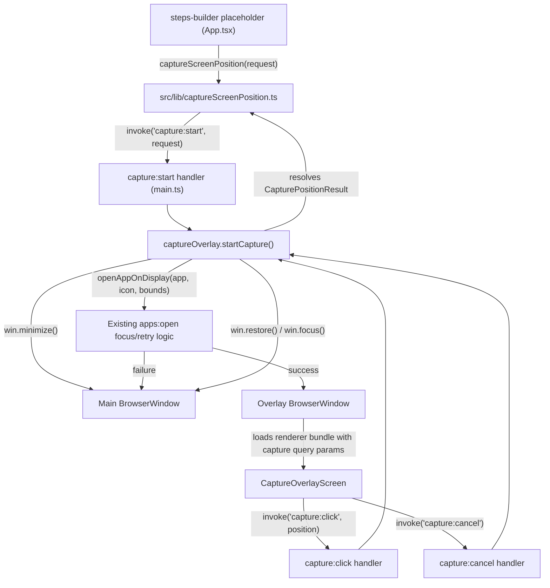

# F04. Screen Position Capture — Technical Specification

## 1. Technical Overview

**What:** A self-contained, reusable screen-position capture mechanism: a new overlay `BrowserWindow` rendered on the target monitor, a small set of new IPC channels coordinating it with the main process, and a renderer-side function (`captureScreenPosition`) exposing a single input/output contract — `{ targetApp, monitorBounds } → { status: "captured", position } | { status: "cancelled" } | { status: "error" }`. Invoking it minimizes Cronos, opens/focuses the target app on the selected monitor (reusing the existing `apps:open` focus/retry logic verbatim), shows a transparent, always-on-top, crosshair-cursor overlay sized exactly to that monitor, captures the next left click's coordinate relative to the overlay's own origin (which is the monitor's origin), and restores Cronos. ESC cancels at any point before the click.

**Why:** F04 sits between F03 (already implemented, produces a `DraftActionBasicInfo` carrying the target app and monitor) and F05 (Wave 5, not yet built), and is also the sibling of F08 (Wave 4, spec'd in parallel, not yet built) which will read the coordinates F04 produces at execution time. Because neither consumer exists yet, F04 must define its own boundary precisely — the exact request/response shape a future F05 will call, and the exact coordinate space (monitor-relative, not absolute) a future F08 will translate back to an absolute screen point — rather than assume anything about either feature's internals. This mirrors the precedent F07 already set for its own not-yet-built consumer (F08): build the real, working mechanism now, and wire a minimal, temporary trigger into the existing placeholder so the whole flow is exercisable and testable end-to-end today.

**Scope:**

**Included** (Core Scope):
- Minimizing Cronos, reusing the existing `apps:open`/focus logic to open or focus the target app maximized on the selected monitor.
- Displaying a full-screen, transparent, always-on-top overlay window sized exactly to the selected monitor's bounds, with a ~15% black tint and a crosshair cursor.
- Capturing the next left click's coordinate, relative to the selected monitor's origin.
- ESC-to-cancel at any point before the click.
- Closing the overlay and restoring Cronos on every outcome (captured, cancelled, or error), with the new/updated step highlighted being a concern of the not-yet-built F05, not of F04 itself.
- The error path when the target app cannot be opened/focused (aborts before the overlay becomes interactive, restores Cronos, surfaces the PRD's exact error string for the caller to show as a toast).
- A minimal, temporary trigger wired into `src/App.tsx`'s existing `steps-builder` placeholder (F05's stand-in) so the capture flow is exercisable end-to-end today, per the same precedent F07 set for F08.

**Deferred** (Full Scope addition, per Auto-Accept Policy — Core only):
- "Redo position" — re-running the capture flow against an *existing* Click/Automatic-Digitar step to overwrite just its coordinate. The mechanism this spec builds (`captureScreenPosition`) is generic enough that a future F05 can call it again for this purpose, but the step-lookup/overwrite semantics themselves, and PRD Section 9's "Using 'Redo position'..." acceptance criterion, are out of scope here and left for a later spec once F05 exists.

## 2. Architecture Impact

**Affected components:**

- `src/lib/captureScreenPosition.ts` (new) — the renderer-side public contract: `CapturePositionRequest`/`CapturePositionResult` types, the `captureScreenPosition()` function wrapping `capture:start`, and `getCaptureErrorMessage(appName)` returning F04's own PRD-mandated error string.
- `src/screens/CaptureOverlayScreen.tsx` (new) — the overlay window's own React view: a loading state ("Abrindo [app]...") followed by an interactive, tinted, crosshair-cursor capture surface; wires the left-click and ESC handlers.
- `src/main.tsx` (modified) — branches the renderer's root render between the normal `<App />` and `<CaptureOverlayScreen />` based on a launch query parameter, so the overlay window can load the same built renderer bundle without a new Vite HTML entry point.
- `src/App.tsx` (modified) — the existing `steps-builder` placeholder gains a temporary "Simular captura de posição (temporário)" button (analogous to the existing "Simular sucesso (temporário)" button) that calls `captureScreenPosition` with the draft's `targetApp`/`monitorBounds` and displays the outcome, exercising the full flow without any real steps-builder UI.
- `electron/captureOverlay.ts` (new) — owns the overlay `BrowserWindow`'s lifecycle/configuration and the single in-flight capture state machine; exports `startCapture(...)`, `handleOverlayClick(...)`, `handleOverlayCancel(...)`.
- `electron/main.ts` (modified) — registers the three new IPC handlers (`capture:start`, `capture:click`, `capture:cancel`), delegating to `captureOverlay.ts` and injecting the existing `openAppOnDisplay` function and the main window reference; no changes to the existing `apps:*`/`actions:*`/`displays:list` handlers.



## 3. Technical Decisions

| Decision | Chosen Approach | Alternative Considered | Trade-off |
|---|---|---|---|
| Overlay content delivery | Load the same built renderer bundle in the overlay `BrowserWindow`, branching in `main.tsx` on a `?capture=1&app=<name>` query parameter | Add a dedicated `overlay.html` Vite entry point (`vite-plugin-electron`'s `renderer` config) | Avoids touching the build configuration and keeps the overlay screen testable with the exact same React/RTL/jsdom setup as every other screen, at the cost of one small conditional branch in `main.tsx` |
| Reusing the existing app-open/focus logic | `captureOverlay.ts` receives `openAppOnDisplay` as an injected dependency and calls it directly (in-process function call) | Have `capture:start`'s handler invoke the existing `apps:open` IPC channel as a second internal round-trip | A direct call avoids a redundant IPC hop and keeps `captureOverlay.ts` unit-testable in isolation (inject a fake) without mocking all of `main.ts`'s other registrations; matches the explicit instruction to reuse, not reimplement, this logic |
| Coordinate space | The overlay `BrowserWindow` is positioned and sized exactly to the selected monitor's bounds, so a click's `event.clientX/clientY` inside the overlay's own document *is* the coordinate relative to that monitor's origin, with no extra math | Capture the click as an absolute OS coordinate (e.g., via a global mouse hook) and subtract `monitorBounds.x/y` in the main process | Zero-cost relative coordinates given a design that already requires the overlay to be sized/positioned to the monitor bounds; avoids introducing any native mouse-hook dependency, consistent with "no new npm dependency needed" |
| Overlay creation timing vs. app-open completion | Create and show the overlay (in a non-interactive loading state) as soon as `capture:start` begins, in parallel with the app-open/focus retries; only wire up click capture once `openAppOnDisplay` resolves `true`. If it resolves `false`, the overlay is destroyed having never become interactive | Create the overlay strictly after `openAppOnDisplay` resolves (matching the PRD Core Scope bullet's literal step order) | The PRD's own Experience bullet requires a loading indicator to be visible *during* the ~5-6.6s open/focus wait, which is only possible if the overlay window already exists at that point; this resolves that tension with the Error Handling bullet ("...instead of opening the overlay") by treating "opening the overlay" as becoming the *interactive* capture surface, which never happens on failure — see Assumptions below |
| Always-on-top strength | `overlayWindow.setAlwaysOnTop(true, 'screen-saver')` (Electron's highest always-on-top level) | Default `alwaysOnTop: true` at the constructor's default level | The target app was just forcibly focused/maximized by `openAppOnDisplay`'s own reassertion loop; the highest level is needed so the overlay reliably wins that race and stays on top of it, at no functional cost since this window is intentionally the topmost thing on screen during capture |

### Assumptions / Decisions (PRD gaps filled via Auto-Accept policy)

- **Scope = Core only** (Auto-Accept Policy, decided by orchestrator). "Redo position" and its acceptance criterion are Deferred — see Section 1.
- **PRD-internal sequencing tension (overlay timing).** The PRD's Core Scope bullet lists "open/focus the target app... display a full-screen transparent overlay..." in that order, implying the overlay appears only after a successful open. Its Experience bullet says the overlay shows a loading indicator "while the target app is being opened/focused," implying the overlay exists *during* the open. Its Error Handling bullet says a failure to open happens "instead of opening the overlay." Resolution (documented, not asked): the overlay window is created immediately and shown in a non-interactive loading state while `openAppOnDisplay` runs; it only becomes click-capturing once that call resolves `true`, and is destroyed unopened-for-capture if it resolves `false`. This satisfies all three bullets under the reading that "opening the overlay" means becoming the interactive capture surface.
- **Overlay entry point.** Not specified by the PRD. Chosen: reuse the single existing renderer bundle via a `?capture=1&app=<url-encoded name>` query string read in `src/main.tsx`, rather than adding a new Vite HTML entry. See Technical Decisions.
- **New IPC channel names.** Not specified by the PRD. Chosen: `capture:start` (the only channel a future F05 calls, via `captureScreenPosition`), `capture:click` and `capture:cancel` (internal — called only by `CaptureOverlayScreen` itself, never by F05 directly), following the existing `domain:verb` naming convention (`actions:get`, `displays:list`, `apps:open`).
- **`captureScreenPosition` shape: function, not a hook.** The PRD doesn't specify. Chosen: a plain async function wrapping one `invoke` call, matching the codebase's existing convention of calling `window.ipcRenderer.invoke(...)` directly/inline everywhere (no React hook abstraction exists anywhere else in the renderer for IPC calls).
- **Error toast text ownership.** The PRD's F04 Experience block specifies the exact string ("Não foi possível abrir [app] para capturar a posição.") as F04's own. Since F04 has no persistent "screen" of its own to host a `<Toast>` (it only ever shows the overlay or nothing), `src/lib/captureScreenPosition.ts` exports `getCaptureErrorMessage(appName)` returning that exact string, and the *caller* (today, the temporary placeholder trigger; later, F05) is responsible for rendering it via the existing `<Toast>`/`pendingToast` mechanism already established in `src/App.tsx`.
- **Reentrancy.** Not specified. Chosen: only one capture may be in flight at a time; a `capture:start` call received while another is still pending resolves immediately with `{ status: "error" }` rather than queuing, since the UI never triggers concurrent captures.
- **Left-click only.** "The next left-click's absolute coordinate" (PRD) is read literally: the overlay's click handler ignores `event.button !== 0` (right-click, middle-click) entirely — no capture, no cancel, no state change.
- **No new npm dependency.** Electron's own `BrowserWindow` (transparent, frameless, always-on-top) and native DOM `click`/`keydown` events on a real focused window are sufficient for both the overlay and ESC-to-cancel; no `robotjs`-style native-input dependency, and no `globalShortcut` registration, is needed since the overlay window itself receives these events directly while focused. This confirms rather than overrides the codebase's existing zero-native-input-dependency posture.
- **DPI/coordinate-space consistency.** Electron's `screen.getAllDisplays()` bounds (already consumed by F03 via `displays:list`) and `BrowserWindow` x/y/width/height use the same DPI-normalized pixel space as a window's own `clientX/clientY`, so no additional scaling is applied — consistent with how `openAppOnDisplay`/`focusRunningApp` already position windows using raw `displayBounds` values without DPI conversion.
- **Overlay window loading in dev vs. production.** Mirrors the existing `createWindow()` branch in `electron/main.ts`: `win.loadURL(VITE_DEV_SERVER_URL + query)` in dev, `win.loadFile(indexHtmlPath, { query })` in production.
- **Placeholder wiring location.** Following the exact precedent F07 set for its not-yet-built consumer (F08) — a temporary trigger proves the payload/flow is correct without building the real consumer early — this spec adds its temporary trigger to the *existing* `steps-builder` placeholder in `src/App.tsx` (F05's stand-in), rather than introducing a new placeholder screen, since F04 is the mechanism being built here and F05 is the not-yet-built consumer.
- **Result display on the temporary trigger.** Not specified by the PRD (this is scaffolding, not a real UI). Chosen: on captured, show the coordinate as plain text ("Posição capturada: (x, y)"); on cancelled, show "Captura cancelada."; on error, show the PRD's exact error toast via the existing `pendingToast` mechanism. None of this is part of F04's real contract — only `captureScreenPosition`'s return value and `getCaptureErrorMessage` are.

## 4. Component Overview

**Frontend:**

| File Path | New/Modified | Purpose | Key Responsibilities |
|---|---|---|---|
| `src/lib/captureScreenPosition.ts` | New | F04's public renderer contract | Defines `CapturePositionRequest`/`CapturePositionResult`; exposes `captureScreenPosition(request)` wrapping `invoke('capture:start', request)`; exposes `getCaptureErrorMessage(appName)` returning the PRD's exact error string |
| `src/screens/CaptureOverlayScreen.tsx` | New | The overlay window's own view | Renders the loading state ("Abrindo [app]..."); listens for the main process's "ready" signal to switch to the tinted, crosshair-cursor interactive state; captures the next left click (`invoke('capture:click', ...)`); listens for ESC at any time (`invoke('capture:cancel')`) |
| `src/main.tsx` | Modified | Renderer bootstrap | Reads the launch query string; renders `<CaptureOverlayScreen appName={...} />` instead of `<App />` when `capture=1` is present |
| `src/App.tsx` | Modified | Root screen switcher | Adds a temporary "Simular captura de posição (temporário)" trigger to the `steps-builder` placeholder, calling `captureScreenPosition` with the draft's `targetApp`/`monitorBounds` and surfacing the outcome (captured/cancelled/error) |

**Backend:**

| File Path | New/Modified | Purpose | Key Responsibilities |
|---|---|---|---|
| `electron/captureOverlay.ts` | New | Overlay window lifecycle + capture state machine | Creates/configures/destroys the overlay `BrowserWindow`; tracks the single in-flight capture; exposes `startCapture(request, deps)`, `handleOverlayClick(position)`, `handleOverlayCancel()`; resolves the pending `capture:start` promise on every outcome |
| `electron/main.ts` | Modified | IPC registrar | Registers `capture:start` (delegating to `captureOverlay.startCapture`, injecting `openAppOnDisplay` and the main `BrowserWindow` reference), `capture:click`, and `capture:cancel` (both delegating to the corresponding `captureOverlay` functions) |

**Database:** None. F04 persists nothing; it returns a coordinate for the (not-yet-built) F05 to attach to a step, which F01 will eventually persist unchanged.

## 5. API Contracts

### New — Start Capture

- **Channel:** `capture:start`
- **Direction:** Renderer (main window) → Main (`invoke`)
- **Called by:** `captureScreenPosition()` in `src/lib/captureScreenPosition.ts` — today, from the temporary `steps-builder` placeholder trigger; later, from F05.

**Request:**

| Field | Type | Required | Validation | Description |
|---|---|---|---|---|
| `targetApp.name` | `string` | Yes | non-empty | Display name of the target app |
| `targetApp.path` | `string` | Yes | non-empty | Launch path passed to `shell.openPath` |
| `targetApp.iconPath` | `string` | Yes | non-empty | Executable path used to match the running process for focus |
| `monitorBounds` | `{ x, y, width, height }` | Yes | all finite numbers | The selected monitor's bounds, exactly as produced by F03's `displays:list` read |

**Request Example:**

```json
{
  "targetApp": { "name": "Notepad", "path": "C:\\Notepad.lnk", "iconPath": "C:\\Windows\\notepad.exe" },
  "monitorBounds": { "x": 1920, "y": 0, "width": 1920, "height": 1080 }
}
```

**Response:**

| Field | Type | Description |
|---|---|---|
| `status` | `"captured" \| "cancelled" \| "error"` | Outcome of the capture attempt |
| `position` | `{ x: number; y: number }` | Present only when `status === "captured"`; coordinate relative to `monitorBounds`' origin |

**Response Example (captured):**

```json
{ "status": "captured", "position": { "x": 512, "y": 340 } }
```

**Response Example (cancelled — ESC pressed):**

```json
{ "status": "cancelled" }
```

**Response Example (error — target app could not be opened/focused):**

```json
{ "status": "error" }
```

**Error Codes:** None — `capture:start` never rejects; every outcome (including app-open failure) resolves with a `status` field. The exact toast string for `status: "error"` is obtained separately from `getCaptureErrorMessage(targetApp.name)`, since the IPC layer stays free of user-facing copy (consistent with `apps:open`/`displays:list`, which also return plain data).

### New — Overlay Click (internal)

- **Channel:** `capture:click`
- **Direction:** Renderer (overlay window only) → Main (`invoke`)
- **Called by:** `CaptureOverlayScreen`, on the first left click received after the overlay's "ready" signal. Not part of F04's public contract — F05 never calls this directly.

**Request Example:**

```json
{ "x": 512, "y": 340 }
```

**Response:** `{ "acknowledged": true }` — the overlay window closes itself once this resolves; the *caller* of `capture:start` is the one that ultimately receives the `"captured"` result.

### New — Overlay Cancel (internal)

- **Channel:** `capture:cancel`
- **Direction:** Renderer (overlay window only) → Main (`invoke`)
- **Called by:** `CaptureOverlayScreen`, on `Escape` keydown, at any time (loading or interactive).

**Request Example:** `{}` (no payload)

**Response:** `{ "acknowledged": true }`

### Reused — Existing App-Open/Focus Logic (unchanged)

`captureOverlay.startCapture` calls the existing `openAppOnDisplay(appPath, iconPath, displayBounds)` function from `electron/main.ts` directly (in-process, dependency-injected — see Technical Decisions), exactly as already used by the `apps:open` IPC handler and as F08 will use it. No changes are made to this function, its retry counts (10 × 500ms + 4 × 400ms reassertions), or its existing `apps:open` IPC exposure.

## 6. Data Model

F04 persists nothing. This section documents the renderer/main-process boundary types it introduces, and how they map onto F01's existing step schema for the (not-yet-built) F05 to consume.

### View type: `CapturePositionRequest` (`src/lib/captureScreenPosition.ts`)

| Field | Type | Description |
|---|---|---|
| `targetApp` | `{ name: string; path: string; iconPath: string }` | Exactly F03's `DraftActionBasicInfo.targetApp` |
| `monitorBounds` | `{ x: number; y: number; width: number; height: number }` | Exactly F03's `DraftActionBasicInfo.monitorBounds` |

### View type: `CapturePositionResult` (`src/lib/captureScreenPosition.ts`)

| Field | Type | Description |
|---|---|---|
| `status` | `"captured" \| "cancelled" \| "error"` | Outcome |
| `position` | `{ x: number; y: number } \| undefined` | Present only when `status === "captured"` |

### Consumer contract (structural note only — for the not-yet-built F05/F08)

A `CapturePositionResult` with `status: "captured"` is expected to be copied verbatim by F05 into a step's existing `position: { x, y }` field — the exact shape F01 already defines on `ClickStep` and `AutoTypeStep` (`electron/actionsStore.ts`). Because the coordinate is monitor-relative (see Technical Decisions), F08 is expected to translate it back to an absolute OS coordinate at execution time by adding the action's configured monitor's *current* `bounds.x`/`bounds.y` (re-read via `displays:list` at execution time, not the value stored when the action was created) before simulating the click — this is what lets a recorded position "stay valid if the monitor's absolute position in the OS layout changes, as long as its resolution/DPI doesn't," per the PRD. Nothing about F05's or F08's internals beyond this single translation rule is defined here.

No database tables, indexes, or migrations apply — every type above is ephemeral, in-memory, or a one-shot IPC payload.

## 7. Testing Strategy

| Test File | Test Type | Target | Coverage Goal |
|---|---|---|---|
| `electron/captureOverlay.test.ts` | Unit | `captureOverlay.ts`'s state machine, in isolation with injected fakes | Every backend-side PRD Section 9 acceptance criterion for F04 |
| `electron/captureIpc.test.ts` | Integration | `capture:start`/`capture:click`/`capture:cancel` wiring through `main.ts` | End-to-end main-process wiring, main-window minimize/restore sequencing |
| `src/lib/captureScreenPosition.test.ts` | Unit | `captureScreenPosition`, `getCaptureErrorMessage` | The renderer-side public contract |
| `src/screens/CaptureOverlayScreen.test.tsx` | Component | `CaptureOverlayScreen` | Loading/interactive states, click/ESC handling |
| `src/App.test.tsx` | Integration (additions) | Temporary `steps-builder` placeholder trigger | End-to-end exercise of the whole capture flow from the renderer entry point that stands in for F05 |

**`electron/captureOverlay.test.ts` functions** (mocks the `electron` module's `BrowserWindow`; injects a fake `openAppOnDisplay` and a fake main `BrowserWindow`):

| Test Function | Description | Assertions |
|---|---|---|
| `test_startCapture_minimizesMainWindowBeforeOpeningApp` | Call `startCapture` with a fake `openAppOnDisplay` that never resolves | The injected main window's `minimize()` is called before `openAppOnDisplay` is invoked (PRD acceptance criterion) |
| `test_startCapture_callsOpenAppOnDisplayWithExactRequestValues` | Call `startCapture` with a specific `targetApp`/`monitorBounds` | The injected `openAppOnDisplay` is called with that exact `path`, `iconPath`, and `monitorBounds` (Cross-Feature Integration criterion, F04's half) |
| `test_startCapture_openSucceeds_createsOverlayWindowSizedToMonitorBounds` | Fake `openAppOnDisplay` resolves `true` | The mocked `BrowserWindow` constructor is called with `x/y/width/height` matching `monitorBounds`, `frame: false`, `transparent: true`, `alwaysOnTop: true` (PRD acceptance criterion — "shows the transparent overlay") |
| `test_startCapture_openFails_neverCreatesInteractiveOverlayAndResolvesError` | Fake `openAppOnDisplay` resolves `false` | The `BrowserWindow` constructor for the *interactive* overlay is never reached (or the overlay is destroyed before any click could occur); `startCapture`'s promise resolves `{ status: "error" }`; the main window's `restore()`/`focus()` are called (PRD Error Handling bullet) |
| `test_handleOverlayClick_resolvesCapturedWithExactPositionAndClosesOverlay` | After a successful `startCapture`, call `handleOverlayClick({ x, y })` | The pending `startCapture` promise resolves `{ status: "captured", position: { x, y } }`; the overlay window's `close()` is called; the main window's `restore()`/`focus()` are called (PRD acceptance criterion) |
| `test_handleOverlayCancel_resolvesCancelledAndClosesOverlay` | After a successful `startCapture`, call `handleOverlayCancel()` | The pending promise resolves `{ status: "cancelled" }`; overlay closes; main window restores/focuses (PRD acceptance criterion — ESC cancels without adding/changing anything) |
| `test_secondConcurrentStartCapture_resolvesErrorImmediately` | Call `startCapture` twice without resolving the first | The second call resolves `{ status: "error" }` immediately, without a second `openAppOnDisplay` call (Assumptions — reentrancy) |
| `test_overlayReadySignal_sentOnlyAfterOpenSucceeds` | Fake `openAppOnDisplay` resolves `true` after a delay | The overlay window's `webContents.send('overlay:ready', ...)` is called only after that resolution, never before (Technical Decisions — loading vs. interactive timing) |

**`electron/captureIpc.test.ts` functions** (follows the `loadMain()` mock pattern from `electron/actionsIpc.test.ts`):

| Test Function | Description | Assertions |
|---|---|---|
| `test_captureStartHandler_registered` | Load `main.ts` | `ipcMain.handle` was called with `'capture:start'`, `'capture:click'`, `'capture:cancel'` |
| `test_captureStartHandler_endToEnd_capturedFlow` | Invoke `capture:start`, then simulate the overlay calling `capture:click` | The `capture:start` invoke promise resolves `{ status: "captured", position }` |
| `test_captureStartHandler_endToEnd_cancelledFlow` | Invoke `capture:start`, then simulate `capture:cancel` | The `capture:start` invoke promise resolves `{ status: "cancelled" }` |

**`src/lib/captureScreenPosition.test.ts` functions** (mocks `window.ipcRenderer.invoke`):

| Test Function | Description | Assertions |
|---|---|---|
| `test_captureScreenPosition_invokesCaptureStartWithExactRequest` | Call with a sample request | `window.ipcRenderer.invoke` called with `('capture:start', request)` |
| `test_captureScreenPosition_resolvesWhateverMainReturns` | Mock `invoke` resolving each of the three result shapes | The function's return value matches exactly, for all three (`captured`/`cancelled`/`error`) |
| `test_getCaptureErrorMessage_returnsExactPrdErrorText` | Call with `"Notepad"` | Returns exactly `"Não foi possível abrir Notepad para capturar a posição."` |

**`src/screens/CaptureOverlayScreen.test.tsx` functions:**

| Test Function | Description | Assertions |
|---|---|---|
| `test_initialRender_showsLoadingTextWithAppName` | Render with `appName="Notepad"` | Shows "Abrindo Notepad..." and no crosshair-cursor capture surface yet |
| `test_clickBeforeReadySignal_doesNotInvokeCaptureClick` | Click the overlay before the `overlay:ready` event fires | `invoke('capture:click', ...)` is never called (Technical Decisions — gated interactivity) |
| `test_readySignalReceived_switchesToInteractiveTintedCrosshairSurface` | Fire the mocked `overlay:ready` event | The loading text disappears; the capture surface renders with the crosshair cursor class and the ~15% black tint styling (PRD Capabilities) |
| `test_leftClickAfterReady_invokesCaptureClickWithRoundedCoordinates` | Fire `overlay:ready`, then click at a given `clientX`/`clientY` | `invoke('capture:click', { x, y })` called once with the exact (rounded) coordinates (PRD acceptance criterion) |
| `test_nonLeftClickAfterReady_isIgnored` | Fire `overlay:ready`, then simulate a right-click | `invoke('capture:click', ...)` is never called (Assumptions — left-click only) |
| `test_escDuringLoading_invokesCaptureCancel` | Press `Escape` before `overlay:ready` fires | `invoke('capture:cancel')` called once (PRD — "ESC cancels... at any point before the click") |
| `test_escAfterReady_invokesCaptureCancel` | Fire `overlay:ready`, then press `Escape` | `invoke('capture:cancel')` called once |

**`src/App.test.tsx` functions (additions for F04):**

| Test Function | Description | Assertions |
|---|---|---|
| `test_stepsBuilderPlaceholder_simulateCaptureButton_callsCaptureScreenPositionWithDraftValues` | From the `steps-builder` placeholder (reached via F03's confirm), click "Simular captura de posição (temporário)" | `captureScreenPosition` (mocked) is called with the exact `targetApp`/`monitorBounds` carried in the draft — same values F03 produced (Cross-Feature Integration criterion: "The target app and monitor selected in F03 are exactly what F04 opens/focuses during capture") |
| `test_simulateCapture_onCaptured_showsCapturedPositionText` | Mock a `"captured"` result | The placeholder displays the returned coordinate |
| `test_simulateCapture_onCancelled_showsCancelledText` | Mock a `"cancelled"` result | The placeholder shows a cancellation indicator; no coordinate is shown |
| `test_simulateCapture_onError_showsExactPrdErrorToast` | Mock an `"error"` result | The existing `<Toast>` mechanism shows exactly `getCaptureErrorMessage(draft.targetApp.name)`'s text |

**Deferred (not covered by this spec's tests, per Section 1 Scope):**

- PRD Section 9's "Using 'Redo position' on an existing step overwrites only that step's coordinate, leaving its other fields untouched" acceptance criterion — belongs to the Full Scope addition, deferred until F05 exists to own step-level state.
