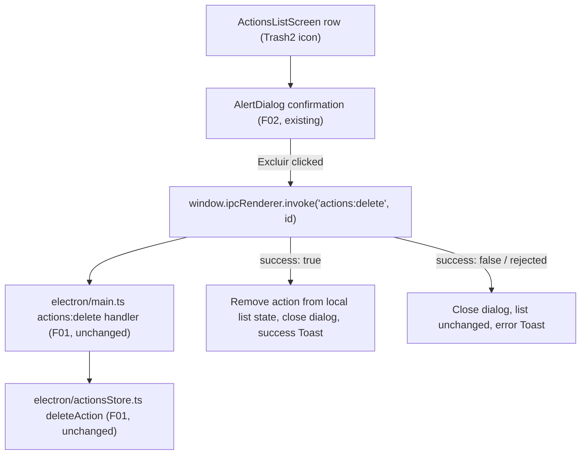

# F06. Delete Action — Technical Specification

## 1. Technical Overview

**What:** Completes the deletion flow for a saved action. The confirmation dialog itself — copy, "Cancelar"/"Excluir" buttons, and the `deleteRequest` state that opens it naming the correct action — already exists in `src/screens/ActionsListScreen.tsx`, built as an explicitly-labeled placeholder by F02 ("F02 renders minimal placeholder surfaces at those three navigation targets"). Today, clicking "Excluir" only closes the dialog (`onClick={() => setDeleteRequest(null)}`); it never calls the `actions:delete` IPC channel that F01 already implements and tests. F06 wires that confirm action to the real channel, updates the visible list immediately on success, and adds the success/error toast and failure handling described by the PRD.

**Why:** F01 (`electron/actionsStore.ts` `deleteAction`, wired in `electron/main.ts` as `ipcMain.handle('actions:delete', ...)`) already provides the full persistence contract this feature needs — validation, atomic write, and a `{ success, error? }` result shape — with its own dedicated test coverage (`electron/actionsStore.test.ts`, `electron/actionsIpc.test.ts`). There is nothing left to build in the main process. The only remaining gap is renderer wiring: turning the existing placeholder confirm button into a real call, reflecting its result in the row list and the toast, and guarding against a duplicate submit while the call is in flight.

**Scope:** Included — replacing the placeholder `AlertDialogAction` handler in `ActionsListScreen.tsx` with a real `actions:delete` call; removing the deleted action from the rendered list immediately on success; showing the success and error toasts specified by the PRD; disabling the dialog's buttons while the request is in flight; updating the existing placeholder-oriented test to assert the real behavior. Excluded — any change to `electron/actionsStore.ts`, `electron/main.ts`, or the `actions:delete` contract itself (F01, already complete and unmodified by this feature); any change to how the dialog opens or is named (F02, already complete and correct per PRD copy).

## 2. Architecture Impact

**Affected components:**

- `src/screens/ActionsListScreen.tsx` (modified) — the `AlertDialogAction` ("Excluir") handler becomes async, calling `actions:delete`, updating local list state, and driving the toast; a small in-flight flag is added to disable the dialog's buttons during the call.
- No `electron/` files are touched — F06 consumes the existing `actions:delete` channel exactly as F01 documented it.

## 3. Technical Decisions

| Decision | Chosen Approach | Alternative Considered | Trade-off |
|---|---|---|---|
| Reflecting a successful delete in the list | Filter the deleted `id` out of the existing `actions` state array directly (optimistic local update), rather than re-invoking `actions:list` | Re-fetch the full list from `actions:list` after a successful delete | The PRD says the action is removed "from the data store and the main list immediately." The IPC call already confirms the write succeeded before the UI updates, so a local filter is exactly as correct as a re-fetch here but avoids an extra IPC round trip and matches the "immediately" wording more directly. |
| Delete-error propagation from IPC to UI | Treat the resolved `{ success, error }` result the same way `actions:save` failures are already handled elsewhere in the app: `success: false` (or a rejected promise, treated identically) closes the dialog and shows the fixed PRD error toast text, without surfacing the store's internal `error` string in the UI | Display the store's returned `error` message verbatim in the toast | The PRD specifies one exact error toast for this feature ("Não foi possível excluir a ação. Tente novamente."), matching the fixed string `actionsStore.ts` already returns for every delete failure (`DELETE_FAILURE_MESSAGE`); there is no scenario in this feature where a different message should reach the user, so treating any non-success outcome (including a transport-level rejection) uniformly is simpler and avoids leaking internal error text |

### Assumptions / Decisions (PRD gaps filled via Auto-Accept policy)

- **In-flight guard on the confirm button.** PRD does not describe a loading state. Decision: both "Cancelar" and "Excluir" are disabled for the duration of the `actions:delete` call, preventing a duplicate confirm or a cancel racing an in-flight delete. No spinner or label change is introduced, since no existing button in this codebase establishes a loading-label convention to follow.
- **Dialog closes on both outcomes.** PRD's Error Handling text says explicitly "the dialog closes" on a persistence failure, matching the existing success path. Decision: the dialog is dismissed unconditionally once the IPC call settles, whether it succeeds or fails — there is no "keep dialog open to retry" behavior for this feature.
- **Toast delivery mechanism.** Reuses the `toastMessage` state and `Toast` component already present in `ActionsListScreen.tsx` for the initial/hand-off toast — no new toast plumbing is introduced.
- **IPC call shape.** `window.ipcRenderer.invoke("actions:delete", id)` — a single positional `id` argument, matching F01's documented contract (`docs/F01-actions-data-store/spec.md`, "Channel: Delete Action") and the same calling convention already used for `actions:get` in this file.
- **Existing placeholder test superseded.** `test_deleteIcon_opensPlaceholderConfirmationNamingTheAction` in `src/screens/ActionsListScreen.test.tsx` currently asserts `actions:delete` is *not* called on confirm (correct for F02's placeholder scope). F06 updates this test's expectation (and its name, dropping the "placeholder" framing) since confirming now must call that channel.
- **No new IPC channel or backend change.** F01's `actions:delete` contract (request/response shape, validation, atomic write, error string) is complete and unmodified by this feature; F06 is renderer wiring only.

## 4. Component Overview

**Frontend:**

| File Path | New/Modified | Purpose | Key Responsibilities |
|---|---|---|---|
| `src/screens/ActionsListScreen.tsx` | Modified | Completes the delete flow | Replaces the placeholder confirm handler with a real `actions:delete` call; on success, removes the action from local `actions` state and shows the success toast; on failure, leaves `actions` state unchanged and shows the error toast; disables both dialog buttons while the call is in flight; closes the dialog once the call settles |

**Backend:** None — F06 consumes the existing `actions:delete` channel (`electron/actionsStore.ts`, `electron/main.ts`) exactly as documented by F01, with no modification.

**Database:** None — no schema or persisted-field changes.

## 5. API Contracts

No new or modified IPC channels. F06 consumes the `actions:delete` channel exactly as already specified in `docs/F01-actions-data-store/spec.md`, Section 5, "Channel: Delete Action": a single positional `id` argument, resolving to `{ success: true }` or `{ success: false, error: "Não foi possível excluir a ação. Tente novamente." }`. See that document for the full request/response contract and error conditions; nothing here diverges from it.

## 6. Data Model

No persisted schema changes. The renderer-local `DeleteRequest` view type already introduced by F02 (`{ id: string; name: string }`, local to `ActionsListScreen.tsx`) is reused unchanged; F06 adds only a transient, non-persisted in-flight boolean alongside it to drive the button-disabled state described in Section 3.

## 7. Testing Strategy

| Test File | Test Type | Target | Coverage Goal |
|---|---|---|---|
| `src/screens/ActionsListScreen.test.tsx` | Unit/Component (existing file, extended) | Real delete confirm/cancel/error behavior | Every F06 acceptance criterion in PRD Section 9, plus the cross-feature integration criterion |

**New/updated test functions in `src/screens/ActionsListScreen.test.tsx`:**

| Test Function | Description | Assertions |
|---|---|---|
| `test_deleteConfirm_invokesActionsDeleteWithCorrectId` | Open the confirmation dialog for a specific row, click "Excluir" | `window.ipcRenderer.invoke` is called with `("actions:delete", <that row's id>)` (replaces the old placeholder-only assertion that it was *not* called) |
| `test_deleteConfirm_success_removesActionFromListAndShowsSuccessToast` | Mock `actions:delete` resolving `{ success: true }` for a named action, confirm | The action's row is no longer rendered; the success toast text `Ação '[nome]' excluída com sucesso.` is shown; the dialog is closed (PRD acceptance criterion) |
| `test_deleteCancel_leavesActionUnchangedInList` | Open the dialog for a row, click "Cancelar" | No `actions:delete` call is made; the row remains rendered exactly as before; the dialog closes (PRD acceptance criterion) |
| `test_deleteConfirm_failure_keepsActionVisibleClosesDialogAndShowsErrorToast` | Mock `actions:delete` resolving `{ success: false, error: "..." }` (or rejecting), confirm | The action's row is still rendered; the dialog is closed; the error toast text `Não foi possível excluir a ação. Tente novamente.` is shown (PRD acceptance criterion) |
| `test_deleteConfirm_disablesButtonsWhileRequestInFlight` | Mock `actions:delete` with a pending/unresolved promise, click "Excluir" | Both "Cancelar" and "Excluir" are disabled until the promise settles |
| `test_integration_deletedActionRemovedFromF01StoreNoLongerAppearsInF02List` | Mock `actions:delete` resolving `{ success: true }` for one of two rendered actions, confirm, then simulate a remount that re-invokes `actions:list` returning only the remaining action | The deleted action is absent both immediately (optimistic removal) and after a fresh `actions:list` fetch, confirming F06's delete is durably reflected in F01's store and F02's list (PRD cross-feature criterion) |
