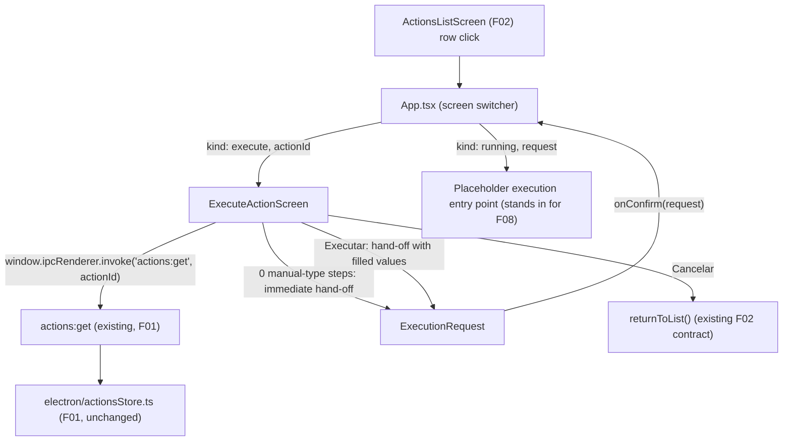

# F07. Execute Action — Manual Fields — Technical Specification

## 1. Technical Overview

**What:** The renderer screen shown when a user clicks an action row on the main list (F02) to run it. It fetches the full action record for the selected id, determines whether the action has any `manual-type` ("Manual-Digitar") steps, and either renders one labeled text input per such step (in step order, always starting empty) gated behind a disabled-until-filled "Executar" button, or — when there are zero `manual-type` steps — skips rendering entirely and hands off straight to execution. A "Cancelar" action returns to the main screen without executing anything. This replaces the temporary `execute` placeholder that F02 wired into `src/App.tsx`'s screen switcher.

**Why:** F02 already built the navigation contract that lands here (`onExecute(actionId)` → `{ kind: "execute", actionId }`) but, by its own stated scope, deliberately fetched nothing and rendered only a stub, leaving the real fetch-and-branch logic to F07 (see F02 spec Section 3, "Edit or execute full-record consumption"). F07 is also the last screen before F08 (Execute Action — Automation Engine), which is a later wave (Wave 4) and does not exist in the codebase yet. That means F07 must not only build the real screen but also define, precisely, the hand-off boundary F08 will later implement — the exact shape of "filled-in manual field values, keyed by step id" that the PRD's Provides block promises, and the call/interface through which "begins execution immediately" happens. Getting that boundary right now (mirroring the placeholder-screen precedent F02 already established for F03/F06/F07 itself) avoids rework when F08 is built.

**Scope:** Included — loading the target action via the existing `actions:get` channel, detecting and ordering its `manual-type` steps, the skip-to-execution path for zero manual steps, the manual-fields form (labeled inputs, placeholders, empty-by-default, Executar enablement rule), the Cancelar path back to the main screen, and a structurally-defined hand-off interface/placeholder destination standing in for F08's not-yet-built entry point. Excluded — anything F08 owns: actually minimizing Cronos, opening/focusing the target app, simulating clicks/keystrokes/typing, or the success/error toasts and screen return that happen after a real execution completes. Those remain out of scope here and are only referenced enough to keep the F07/F08 boundary clean.

## 2. Architecture Impact

**Affected components:**

- `src/screens/ExecuteActionScreen.tsx` (new) — the F07 screen itself: fetches the action, detects manual steps, renders the form or triggers the skip path, owns field state and the Executar enablement rule.
- `src/App.tsx` (modified) — the `execute` screen kind now renders the real `ExecuteActionScreen` instead of the temporary placeholder; a new `running` screen kind is added as the hand-off destination standing in for F08, carrying the exact payload F07 produces.
- `src/components/ui/label.tsx` (new) — a shadcn `Label` primitive, added because none exists yet in this codebase, used to associate each manual field's visible label with its input (accessible `htmlFor`/`id` pairing), following the same "reuse shadcn primitives" convention F02 established for `Input`/`Button`/`AlertDialog`.
- No `electron/` files are touched — F07 consumes only the existing `actions:get` channel; no new IPC channel is introduced, and no schema changes are made to F01's store.



## 3. Technical Decisions

| Decision | Chosen Approach | Alternative Considered | Trade-off |
|---|---|---|---|
| Where the action record is fetched | `ExecuteActionScreen` calls `actions:get` itself on mount, exactly as F02's own spec assumed it would | Have `App.tsx`/F02 pre-fetch the full record and pass it down when navigating to execute | Matches the boundary F02 already documented ("F07 is expected to fetch its own copy rather than receive it secondhand through F02"); also guarantees the fields reflect the action's *current* saved steps even if it was edited since the list was last loaded |
| Representing "begins execution immediately" before F08 exists | Define a structural `ExecutionRequest` payload (`actionId` + `manualValues` keyed by step id) and a `onConfirm` callback that `App.tsx` routes to a new `running` screen kind — a placeholder destination that stands in for F08's entry point, carrying the exact payload forward | Block/stub out the whole confirm action until F08 is spec'd, or hard-code a no-op | Mirrors the exact precedent F02 set for F03/F06/F07 itself (placeholder destinations that prove the transition and payload are correct without building the target feature early); lets every F07 acceptance criterion about "proceeds to execution carrying the entered values" be genuinely testable today |
| Manual-field non-empty validation | `value.trim().length > 0` per field, gating the Executar button | Raw `value.length > 0` (no trim) | Matches F01's own `isNonEmptyString` convention (trim before checking) already used for the `name` and step `label`/`placeholder` fields; without trimming, a whitespace-only entry would incorrectly enable Executar |
| Label association for manual fields | Add a `src/components/ui/label.tsx` shadcn `Label` primitive and pair each with its `Input` via matching `htmlFor`/`id` | Render a bare `<label>` element inline in `ExecuteActionScreen` | Keeps the manual-fields form visually and structurally consistent with the shadcn-based `Input`/`Button`/`AlertDialog` primitives F02 already introduced, at the cost of one small new component file |

### Assumptions / Decisions (PRD gaps filled via Auto-Accept policy)

- **Screen/component file name and location.** Not specified by the PRD. Chosen: `src/screens/ExecuteActionScreen.tsx`, following the exact naming convention already established by `src/screens/ActionsListScreen.tsx`.
- **F08 hand-off boundary shape.** The PRD's F07 Provides block says only "filled-in manual field values, one per Manual-Digitar step, keyed by step id (used by F08)," and F08 doesn't exist yet. Decision: define `ExecutionRequest { actionId: string; manualValues: Record<string, string> }` as the exact payload F07 produces on both the skip path (`manualValues: {}`) and the confirm path, and have `App.tsx` carry it into a new `{ kind: "running"; request: ExecutionRequest }` screen state — a placeholder screen (analogous to today's `PlaceholderScreen`) that stands in for F08's real automation engine until that feature is built. This is a structural interface only; nothing about F08's actual execution behavior (window focus, click/keystroke simulation, toasts) is defined or implemented here.
- **Loading UI while checking for manual steps.** Not specified. Decision: render nothing (no spinner, no "Carregando..." text) while `actions:get` resolves, rather than reusing `ActionsListScreen`'s loading text pattern. Since `actions:get` reads only the already-loaded in-memory store (no disk I/O per F01), the round trip is effectively instantaneous, and the PRD explicitly frames the zero-manual-steps case as "skipped entirely" — a visible loading flash before an instant skip would contradict that.
- **Step order for rendering fields.** The PRD says "one text input per Manual-Digitar step... in step order." Decision: iterate the action's `steps` array (as returned by `actions:get`) in its stored array order and filter to `type === "manual-type"` — no separate ordering field is needed since F01 already preserves insertion/save order in the persisted array.
- **Values map contents.** Decision: `manualValues` contains exactly one entry per `manual-type` step present on the action (keyed by that step's `id`), and no entries for any other step type. This matches the PRD's "one per Manual-Digitar step" wording precisely and gives F08 an unambiguous lookup table keyed the same way its own step list is keyed.
- **`actions:get` resolving `null` (action deleted between the F02 list render and this screen's fetch).** Not addressed by the PRD for F07. Decision: treated the same as a zero-manual-steps action — the screen attempts the immediate hand-off with an empty `manualValues` map rather than showing an error, deferring any "action no longer exists" failure surface to F08's own error handling (F08's PRD block already owns target-app/monitor-not-found error toasts; this is a natural extension of that boundary, and this edge case is outside F07's own Section 9 acceptance criteria).
- **Cancelar toast behavior.** The PRD's F07 Experience block says only that Cancelar "returns to the main screen without executing anything," with no mention of a toast. Decision: reuse the existing `returnToList()` contract from F02 with no message argument (`returnToList()`), consistent with F02/F06's own "canceling closes the dialog with no changes" pattern, which likewise shows no toast on cancellation.
- **New shadcn `Label` component.** No label primitive exists in `src/components/ui/` yet (only `button.tsx`, `input.tsx`, `alert-dialog.tsx`). Added as a small new file per the Technical Decisions table, following the project's established pattern of adding one shadcn primitive per new UI need (as F02 did for `Input` and `AlertDialog`).
- **Field state persistence.** Per PRD Capabilities ("Fields always start empty on every execution — values are not remembered between runs"), no `localStorage`, session state, or memoization across mounts is introduced; the field-values map is fresh local component state initialized once per mount, discarded when the screen unmounts.

## 4. Component Overview

**Frontend:**

| File Path | New/Modified | Purpose | Key Responsibilities |
|---|---|---|---|
| `src/screens/ExecuteActionScreen.tsx` | New | F07's screen | Fetches the action via `actions:get` on mount; derives the ordered list of `manual-type` steps; immediately hands off (`onConfirm`) with an empty values map when that list is empty; otherwise renders one labeled `Input` per step, tracks field values in a `Record<string, string>` keyed by step id, computes the Executar-enabled rule, and wires Executar/Cancelar to `onConfirm`/`onCancel` |
| `src/App.tsx` | Modified | Root screen switcher | Renders `ExecuteActionScreen` for the `execute` screen kind (replacing the placeholder); adds and renders the `running` screen kind as the placeholder hand-off destination standing in for F08, carrying the `ExecutionRequest` payload; wires `ExecuteActionScreen`'s `onCancel` to the existing `returnToList` |
| `src/components/ui/label.tsx` | New | Shared label primitive | Renders an accessible `<label>` styled consistently with the existing shadcn `Input`/`Button` primitives, used once per manual field |

**Backend:** None — F07 introduces no changes to `electron/`. It consumes the existing `actions:get` channel exactly as F01 and F02 already documented it.

**Database:** None — no schema or persisted-field changes; F07 only reads data F01 already owns and produces an in-memory, never-persisted values map for hand-off.

## 5. API Contracts

### Consumed — Get Single Action (unchanged from F01/F02)

- **Channel:** `actions:get`
- **Direction:** Renderer → Main (`invoke`)
- **Called by:** `ExecuteActionScreen`, with the `actionId` carried in the `execute` screen state, on every mount (never cached across executions, per the "fields always start empty" requirement).

**Request Example:**

```json
{ "id": "3f2e1a70-9b34-4c3e-8f10-2f6b0e1a9c21" }
```

**Response used by F07 (subset of the full `Action` record F01 documents):**

```json
{
  "id": "3f2e1a70-9b34-4c3e-8f10-2f6b0e1a9c21",
  "name": "Preencher relatório",
  "steps": [
    { "id": "8a1b...", "type": "click", "position": { "x": 512, "y": 340 } },
    { "id": "7f3c...", "type": "manual-type", "label": "Nome do cliente", "placeholder": "Ex: João Silva" },
    { "id": "9c2d...", "type": "wait", "seconds": 3 },
    { "id": "4e5f...", "type": "manual-type", "label": "Número do pedido" }
  ]
}
```

`ExecuteActionScreen` reads only `steps` (filtering to `type === "manual-type"`, preserving array order, reading `id`, `label`, and optional `placeholder` off each). All other step types and action fields are ignored by this screen.

**Error Codes:** None (matches F01/F02: an unknown `id` resolves to `null`, handled per the Assumptions section above; a known id from a rendered F02 row always resolves to a record).

### Provided — Execution Hand-off Contract (structural interface for F08; not a live IPC channel)

This is the "Provides" boundary from the PRD's F07 block, expressed as the exact shape F08 will consume once built. F08 does not exist yet, so nothing below is a real automation call — it is the contract `ExecuteActionScreen` fulfills and that a future F08 implementation plugs into, via the `running` screen state `App.tsx` introduces as its placeholder destination.

**Payload: `ExecutionRequest`**

| Field | Type | Description |
|---|---|---|
| `actionId` | `string` | The action to execute, unchanged from the id F02 originally passed in |
| `manualValues` | `Record<string, string>` | One entry per `manual-type` step on the action, keyed by that step's `id`; the user-entered value, trimmed-non-empty by construction; an empty object (`{}`) when the action has zero `manual-type` steps |

**When it fires:**

- Immediately on mount, with `manualValues: {}`, when the loaded action has zero `manual-type` steps (the "skip straight to execution" path).
- On "Executar" click, with `manualValues` populated from every field, once all fields are non-empty (the normal path).

**Example (two manual steps filled in):**

```json
{
  "actionId": "3f2e1a70-9b34-4c3e-8f10-2f6b0e1a9c21",
  "manualValues": {
    "7f3c...": "João Silva",
    "4e5f...": "PED-4821"
  }
}
```

**Example (zero manual steps — skip path):**

```json
{
  "actionId": "3f2e1a70-9b34-4c3e-8f10-2f6b0e1a9c21",
  "manualValues": {}
}
```

**Consumer contract for F08 (structural note only):** F08 is expected to look up the `manual-type` step on the action whose `id` matches each key in `manualValues` and use that value as the text typed for that step, exactly as it would use a `text` field on an `auto-type` step (per PRD Section 6 F08, "Automatic-Digitar and Manual-Digitar steps simulate typing the associated text"). No other coupling between F07 and F08 is defined here; F08's own spec owns everything about how execution actually runs.

## 6. Data Model

F07 persists nothing and adds no fields to F01's schema. This section documents the renderer-side, in-memory-only view types it introduces instead of a database table.

### View type: `ManualField` (local to `src/screens/ExecuteActionScreen.tsx`)

| Field | Type | Source | Description |
|---|---|---|---|
| `stepId` | `string` | `actions:get` (`Step.id`) | Identifies which `manual-type` step this field belongs to; used as the key in `manualValues` |
| `label` | `string` | `actions:get` (`Step.label`) | Displayed as the field's `Label` text |
| `placeholder` | `string \| undefined` | `actions:get` (`Step.placeholder`) | Displayed as the `Input`'s placeholder when the field is empty |
| `value` | `string` | Local component state | The user-entered text; starts as `""` on every mount |

### View type: `ExecutionRequest` (boundary type, defined in `src/screens/ExecuteActionScreen.tsx`, imported by `src/App.tsx`)

| Field | Type | Description |
|---|---|---|
| `actionId` | `string` | The action to execute |
| `manualValues` | `Record<string, string>` | See API Contracts Section 5 above |

### View type: `Screen` addition (local to `src/App.tsx`)

| Variant | Fields | Meaning |
|---|---|---|
| `{ kind: "execute"; actionId: string }` | `actionId` | Now renders the real `ExecuteActionScreen` (previously F02's placeholder) |
| `{ kind: "running"; request: ExecutionRequest }` | `request: ExecutionRequest` | New — placeholder hand-off destination standing in for F08, carrying the exact payload F07 produced |

No indexes, constraints, or migrations apply — all three types are ephemeral, in-memory React state.

## 7. Testing Strategy

| Test File | Test Type | Target | Coverage Goal |
|---|---|---|---|
| `src/screens/ExecuteActionScreen.test.tsx` | Unit/Component | `ExecuteActionScreen` | Every acceptance criterion in PRD Section 9 for F07, plus field ordering, trimming, and the skip/hand-off payload shape |
| `src/App.test.tsx` | Integration | Screen-switch contract for the `execute`/`running` states | The real F07 screen and the F08 placeholder hand-off are wired correctly, replacing the F02-era placeholder assertions for the `execute` kind |

**`src/screens/ExecuteActionScreen.test.tsx` functions:**

| Test Function | Description | Assertions |
|---|---|---|
| `test_zeroManualSteps_skipsFormAndHandsOffImmediately` | Mock `actions:get` returning an action with only `click`/`wait`/`press-key` steps | No input is rendered; `onConfirm` is called once with `{ actionId, manualValues: {} }` without any user interaction (PRD acceptance criterion) |
| `test_oneManualStep_rendersLabeledInputStartingEmpty` | Mock an action with a single `manual-type` step (`label`, `placeholder`) | One `Input` renders, labeled with that step's `label`, showing the configured `placeholder`, with an empty initial value (PRD acceptance criterion) |
| `test_multipleManualSteps_rendersOneInputPerStepInStepOrder` | Mock an action whose `steps` array interleaves manual and non-manual steps | Rendered inputs appear in the same relative order as the `manual-type` entries in `steps`, one per such step, none for other step types |
| `test_executarDisabled_untilAllFieldsNonEmpty` | Mock 2 manual steps; fill only one field | "Executar" remains disabled (PRD acceptance criterion) |
| `test_executarDisabled_whenFieldIsWhitespaceOnly` | Fill a field with only spaces | "Executar" remains disabled (trim-based validation) |
| `test_executarEnabled_onceAllFieldsFilled` | Fill every rendered field with non-empty text | "Executar" becomes enabled (PRD acceptance criterion) |
| `test_executarClick_handsOffValuesKeyedByStepId` | Fill all fields with distinct values, click "Executar" | `onConfirm` is called once with `{ actionId, manualValues }`, where each key is the exact step id and each value is the exact entered (trimmed) text (PRD acceptance criterion) |
| `test_cancelarClick_invokesOnCancelWithoutHandOff` | Click "Cancelar" with fields partially filled | `onCancel` is called; `onConfirm` is never called |
| `test_actionsGetReturnsNull_treatedAsZeroManualSteps` | Mock `actions:get` resolving `null` | No input is rendered; `onConfirm` is called once with an empty `manualValues` map (Assumptions section) |

**`src/App.test.tsx` functions (additions/updates for F07):**

| Test Function | Description | Assertions |
|---|---|---|
| `test_onExecute_actionWithManualSteps_rendersExecuteActionScreen` | Trigger `onExecute(id)` from the list for an action with `manual-type` steps | The real `ExecuteActionScreen` renders with the corresponding labeled input(s), replacing the old placeholder assertion |
| `test_onExecute_actionWithZeroManualSteps_reachesRunningPlaceholderImmediately` | Trigger `onExecute(id)` for an action with no `manual-type` steps | The app reaches the `running` placeholder state with `manualValues: {}` without any intermediate form being shown |
| `test_executeScreenConfirm_carriesExecutionRequestToRunningPlaceholder` | From `ExecuteActionScreen`, fill fields and confirm | The `running` placeholder receives the exact `ExecutionRequest` (`actionId` + `manualValues`) produced by the screen |
| `test_executeScreenCancel_returnsToActionsListWithoutRunning` | From `ExecuteActionScreen`, click "Cancelar" | The app returns to `ActionsListScreen`; no `running` state is ever reached |

**Cross-feature integration tests** (F07's side of the PRD Section 9 "Cross-Feature Integration" bullets that name F07):

| Test Function | Description | Assertions |
|---|---|---|
| `test_integration_stepListFromF01DeterminesScreenShownOrSkipped` | Using two actions persisted with a realistic F01/F05 shape — one with `manual-type` steps, one without — mount `ExecuteActionScreen` for each | The action with manual steps shows the form; the action without skips directly to the hand-off, confirming F01's stored `steps` array alone (not any separate flag) drives the branch (PRD cross-feature criterion) |
| `test_integration_manualValuesKeyedCorrectlyForF08Consumption` | Mock an action with multiple `manual-type` steps carrying distinct `id`s, fill and confirm | The resulting `manualValues` map's keys exactly match the `manual-type` steps' `id`s from the loaded action record, so a future F08 can apply each value to the correct step when executing (PRD cross-feature criterion) |
