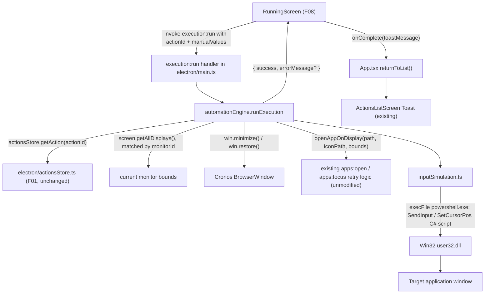

# F08. Execute Action — Automation Engine — Technical Specification

## 1. Technical Overview

**What:** The main-process automation engine that actually runs a saved action once F07 (Execute Action — Manual Fields) hands off its `ExecutionRequest`. It replaces the temporary `running` placeholder in `src/App.tsx` (the "Simular sucesso (temporário)" stub) with a real flow: minimize Cronos, open/focus the target app maximized on the action's currently-configured monitor (reusing the existing `apps:open`/focus retry logic unmodified), then execute every saved step in order — simulating a mouse click for `click`/`auto-type` steps at the step's recorded coordinate translated into the monitor's *current* absolute position, simulating Unicode text typing for `auto-type`/`manual-type` steps, and simulating a key-plus-modifiers press for `press-key` steps — observing the action's default delay between steps, then restoring Cronos and reporting success or the specific failure that stopped the run.

**Why:** F08 is the terminal feature of the PRD's execution chain (F01 → F02 → F07 → F08) and the only feature in this codebase that must talk to the OS below Electron's own window-management API: it has to move the mouse, click, and type into a window Cronos itself does not own. The codebase already solved one OS-level problem this way — window placement/focus via `powershell.exe` running inline C# that P/Invokes `user32.dll` (`electron/main.ts`'s `WIN32_TYPE_DEFINITION` + `focusRunningApp`) — and no input-simulation npm dependency exists anywhere in the project. F08's job is to extend that exact precedent to cover the three new primitives (click, type, key-press) the PRD requires, rather than introduce a new native dependency, and to define the coordinate-translation and manual-value-application logic precisely enough that F04 (captured coordinates) and F07 (manual values), both built or being built independently, plug into it correctly.

**Scope:** Included — the `execution:run` orchestration (monitor-existence precondition, minimize, open/focus, sequential step execution with default-delay pausing, restore), the new Win32 SendInput-based input-simulation primitives (click, Unicode text typing, key+modifier press), the monitor-relative-to-absolute coordinate translation, manual-value application to `manual-type` steps, every F08 error path and its exact toast, and the renderer-side `RunningScreen` that replaces the placeholder and reports the result back through the existing `returnToList` toast mechanism. Excluded — anything F07 already owns (the manual-fields form, the `ExecutionRequest` shape itself, the skip-when-no-manual-steps logic) and anything F04 owns (how a coordinate is captured and stored); F08 only consumes both by contract.

## 2. Architecture Impact

**Affected components:**

- `electron/inputSimulation.ts` (new) — Win32 input-simulation primitives (`simulateClick`, `simulateTypeText`, `simulateKeyPress`), each shelling out to `powershell.exe` running a new `Add-Type` C# block that P/Invokes `user32.dll`'s `SendInput`/`SetCursorPos`, following the exact `WIN32_TYPE_DEFINITION` + `execFile('powershell.exe', ['-NoProfile','-NonInteractive','-Command', script], ...)` shelling pattern already used by `focusRunningApp` in `electron/main.ts`.
- `electron/automationEngine.ts` (new) — the orchestration logic: validates the action's configured monitor still exists, minimizes/restores the Cronos `BrowserWindow`, opens/focuses the target app by calling the existing `openAppOnDisplay`, iterates the action's steps applying the default delay and per-step manual-value substitution, dispatches each step to `inputSimulation`, and produces the final `{ success, errorMessage? }` result.
- `electron/main.ts` (modified) — exports `openAppOnDisplay` (previously private) so `automationEngine.ts` can reuse it without duplicating the retry logic; registers the new `execution:run` IPC handler, wiring in the current `BrowserWindow` reference and `actionsStore.getAction`.
- `src/screens/RunningScreen.tsx` (new) — the renderer screen that replaces the `running` placeholder: invokes `execution:run` on mount with the exact `ExecutionRequest` F07 produced, awaits the result, and hands the appropriate toast message back to `App.tsx`.
- `src/App.tsx` (modified) — the `running` screen kind now renders `RunningScreen` instead of `PlaceholderScreen`; its completion callback is wired to the existing `returnToList(toastMessage)`.



## 3. Technical Decisions

| Decision | Chosen Approach | Alternative Considered | Trade-off |
|---|---|---|---|
| Input-simulation mechanism | Extend the existing PowerShell + C#/`user32.dll` P/Invoke technique with a new `Add-Type` block declaring `SendInput`, `SetCursorPos`, `MOUSEINPUT`/`KEYBDINPUT`/`INPUT` structs | Add a native input-simulation npm dependency (`robotjs`, `nut-js`, `node-key-sender`) | Zero new native dependency (no prebuilt-binary/ABI/Electron-rebuild risk), directly consistent with the codebase's own zero-new-native-dependency precedent for window placement and with the PRD's "consistent with the existing window-placement implementation" wording; costs a `powershell.exe` process-spawn (~50-150ms) per simulated action instead of an in-process native call, acceptable since inter-step delays already dominate execution time |
| Mouse positioning + click | `SetCursorPos(x, y)` for absolute pixel positioning, followed by a `SendInput` call carrying `MOUSEEVENTF_LEFTDOWN` then `MOUSEEVENTF_LEFTUP` | Pure `SendInput` with `MOUSEEVENTF_MOVE \| MOUSEEVENTF_ABSOLUTE` using the 0-65535 normalized coordinate space | `SetCursorPos` takes exact virtual-screen pixel coordinates with no normalization/rounding math, matching the same coordinate space `focusRunningApp`'s `SetWindowPlacement` already uses; `SendInput` (Microsoft's recommended API since Windows Vista, superseding `mouse_event`) still performs the actual button-press event injection |
| Unicode text typing | `SendInput` with one `KEYBDINPUT` down/up pair per UTF-16 code unit, `dwFlags = KEYEVENTF_UNICODE`, `wScan` set to the character code | Map each character to a virtual-key code via the OS's active keyboard layout | Works for arbitrary Unicode text (including Portuguese accents: ã, ç, é) regardless of the active keyboard layout, matching the PRD's "simulate typing... as a sequence of character input events" wording exactly; forgoes generating "real" per-key VK events, which is irrelevant here since no target-app behavior in scope depends on raw VK codes for typed text |
| Distinguishing "app cannot be opened" vs "window cannot be found/focused" | An independent `fs.existsSync(action.targetApp.path)` check performed before calling `openAppOnDisplay`, used only to select which of the two PRD error messages to show | Modify `openAppOnDisplay`/`focusRunningApp` to return a richer result distinguishing the failure cause | Keeps the shared function F04 also depends on completely unmodified, eliminating any regression risk while F04 is spec'd and implemented in the same wave; the heuristic cannot detect a shortcut whose target exists but fails to launch for an unrelated reason (that rarer case is reported as "window not found" instead), which is an accepted approximation |
| Ordering the monitor-existence check relative to "minimize Cronos" | Run the monitor-existence check as a precondition *before* minimizing, even though the PRD's Capabilities list states "(1) minimize Cronos... (2) open the target app" as the fixed order | Minimize first, then validate the monitor, then decide whether to restore immediately on failure | The PRD's own Error Handling bullet for this exact case says "execution is cancelled before opening the target app, **Cronos stays visible**" — which is only true if minimize never happened; validating first is the only reading consistent with both PRD statements, so the monitor check is treated as step (0), ahead of the numbered order |
| Execution IPC shape | A single `execution:run` invoke that runs the entire orchestration in the main process and resolves once with the final result, rather than a stream of per-step progress events | `execution:start` + a series of `execution:step-result` push events consumed by the renderer for a progress UI | Matches the PRD's Experience block exactly ("no visible progress UI... beyond the simulated interactions themselves") since Cronos is minimized for the whole run anyway; avoids building and testing an event-streaming contract that nothing in scope consumes |

### Assumptions / Decisions (PRD gaps filled via Auto-Accept policy)

- **`manual-type` steps have no recorded position and therefore no click is simulated for them.** The PRD's Capabilities line "Click / Automatic-Digitar steps simulate a left mouse click..." deliberately excludes Manual-Digitar, and `ManualTypeStep` in `electron/actionsStore.ts` has no `position` field (unlike `ClickStep`/`AutoTypeStep`). Decision: a `manual-type` step only simulates typing its resolved text at whatever control currently holds keyboard focus in the target app at that point in the sequence (typically because a preceding `click` step in the same action already focused the right field, or the app's own tab order lands there) — no cursor movement or click occurs for this step type. This is a load-bearing behavior default the PRD leaves implicit in its own data model.
- **Coordinate translation formula.** Per the orchestrator's cross-feature note and F04's Capabilities ("coordinate is stored relative to the selected monitor's origin"), the absolute screen coordinate used for a step's simulated click is computed as `absoluteX = currentMonitorBounds.x + step.position.x` and `absoluteY = currentMonitorBounds.y + step.position.y`, where `currentMonitorBounds` is fetched fresh (via the same `screen.getAllDisplays()` call that backs the existing `displays:list` IPC handler, invoked in-process since the automation engine already runs in the main process — no renderer round trip needed) and matched by the action's `monitorId`, never the possibly-stale `monitorBounds` baked into the saved `Action` record. This is the exact convention F04's own implementation must produce coordinates for.
- **`execution:run` fetches the action itself; the renderer never re-fetches via `actions:get`.** The `ExecutionRequest` F07 hands off only carries `actionId` + `manualValues`; `execution:run`'s handler calls `actionsStore.getAction(actionId)` directly inside the main process (the same function `actions:get` already wraps), avoiding a redundant renderer→main round trip and guaranteeing the engine acts on the freshest saved record.
- **`actions:get`/`getAction` resolving `null` (action deleted between F07's screen and execution start).** Not addressed by the PRD for F08. Decision: treated as a generic execution failure, reusing the pattern of the "target app cannot be opened" toast family — Cronos is restored (it was never minimized, since the action lookup happens before the monitor check and before minimizing) and an error toast is shown: `"Não foi possível executar a ação: ela pode ter sido excluída."` This is a new toast string not present verbatim in the PRD, added because the PRD's F08 Error Handling block has no bullet for this case and Auto-Accept policy requires an industry-standard default rather than leaving it unhandled.
- **Step-type display labels for the "interrupted at step [n]" toast.** The PRD's error message is `"A execução foi interrompida no passo [n]: [tipo do passo]."` without specifying the exact label text. Decision: reuse the exact Portuguese step-type nouns F05's own Experience block already establishes for step summaries (`"Click em (512, 340)"`, `"Digitar: ..."`, `"Pressionar: Ctrl+S"`, `"Esperar 3s"`, `"Manual: ..."`) — so the five labels are `Click`, `Digitar`, `Pressionar`, `Esperar`, and `Manual`, keeping step-type terminology consistent across F05 and F08 in the UI the user sees.
- **`[n]` is 1-based.** The failed step's position is reported as its 1-based index in the saved `steps` array (`"passo 1"` for the first step), matching how a non-technical user would count steps, not the 0-based array index.
- **Virtual-key code mapping for `PRESS_KEY_ALLOWED_KEYS`.** Not specified by the PRD beyond the key names themselves. Decision: a fixed, explicit mapping to standard Windows virtual-key codes (documented in full in Section 6, Data Model) — e.g., `Enter` → `VK_RETURN (0x0D)`, `Esc` → `VK_ESCAPE (0x1B)` — chosen because these are the standard, stable Win32 constants for exactly these keys; no alternative mapping was considered since these values are effectively fixed by the Windows API itself.
- **Modifier press/release order.** Not specified by the PRD. Decision: modifiers are pressed down in a fixed order (Ctrl, then Alt, then Shift, skipping any not selected) before the main key's down+up, then released in reverse order (Shift, Alt, Ctrl) — the conventional order used by most input-simulation tools and consistent with how a human would naturally hold modifiers before pressing the main key.
- **`RunningScreen` has no visible UI.** Following the same "no loading UI" precedent F07 already established (Assumptions section, "render nothing... while `actions:get` resolves"), and because Cronos is minimized for the entire run per the PRD's own Experience block, `RunningScreen` renders `null` — any visual content would be invisible to the user regardless, since the window itself is off-screen.
- **`execution:run` request/response are the only new IPC surface.** No new channels are added for progress, cancellation, or step-by-step reporting — see the "Execution IPC shape" decision above.
- **Windows-only enforcement.** Per the PRD's own "The whole run is Windows-only in this version" line and the Out-of-Scope section explicitly excluding macOS/Linux input simulation, `inputSimulation.ts`'s functions short-circuit to a failure result on any non-`win32` `process.platform`, mirroring the exact guard `focusRunningApp` already uses (`if (process.platform !== 'win32') return Promise.resolve(false)`).

## 4. Component Overview

**Frontend:**

| File Path | New/Modified | Purpose | Key Responsibilities |
|---|---|---|---|
| `src/screens/RunningScreen.tsx` | New | F08's renderer entry point | Invokes `execution:run` on mount with the `ExecutionRequest` payload; awaits the `{ success, errorMessage? }` result; derives the toast message (success string built from the action's name, or the returned `errorMessage`) and calls `onComplete(toastMessage)`; renders no visible UI |
| `src/App.tsx` | Modified | Root screen switcher | Renders `RunningScreen` for the `running` screen kind (replacing the F07-era `PlaceholderScreen` branch); wires `RunningScreen`'s `onComplete` to the existing `returnToList` |

**Backend:**

| File Path | New/Modified | Purpose | Key Responsibilities |
|---|---|---|---|
| `electron/automationEngine.ts` | New | Execution orchestration | Looks up the action via `actionsStore.getAction`; validates the configured monitor still exists via `screen.getAllDisplays()`; minimizes/restores the Cronos `BrowserWindow`; calls `openAppOnDisplay` and distinguishes "cannot open" from "window not found"; iterates steps applying the default delay, coordinate translation, and manual-value substitution; stops and reports on the first step failure; builds the final result object |
| `electron/inputSimulation.ts` | New | Win32 input-simulation primitives | Exposes `simulateClick(x, y)`, `simulateTypeText(text)`, `simulateKeyPress(key, modifiers)`; each builds and runs a PowerShell/C# `SendInput`/`SetCursorPos` script via `execFile`, parsing a success/failure marker from stdout; owns the virtual-key-code mapping table |
| `electron/main.ts` | Modified | IPC wiring | Adds `export` to `openAppOnDisplay` so it can be imported by `automationEngine.ts`; registers `ipcMain.handle('execution:run', ...)` delegating to `automationEngine.runExecution`, passing a `() => win` accessor for minimize/restore |

**Database:** None — F08 reads the existing `Action`/`Step` records F01 already owns and persists nothing new; no schema or migration changes.

## 5. API Contracts

### New — Run Execution

- **Channel:** `execution:run`
- **Direction:** Renderer → Main (`invoke`)
- **Called by:** `RunningScreen`, once on mount, with the exact `ExecutionRequest` F07 produced.

**Request:**

| Field | Type | Required | Validation | Description |
|---|---|---|---|---|
| `actionId` | `string` | Yes | must resolve via `actionsStore.getAction` | The action to execute |
| `manualValues` | `Record<string, string>` | Yes | keys must be `manual-type` step ids on the action | User-entered values for each `manual-type` step, `{}` when none |

**Request Example:**

```json
{
  "actionId": "3f2e1a70-9b34-4c3e-8f10-2f6b0e1a9c21",
  "manualValues": {
    "7f3c...": "João Silva",
    "4e5f...": "PED-4821"
  }
}
```

**Response (Success):**

| Field | Type | Description |
|---|---|---|
| `success` | `boolean` | `true` when every step ran and Cronos was restored |
| `actionName` | `string` | The executed action's name, used by `RunningScreen` to build the success toast |

**Response Example (success):**

```json
{ "success": true, "actionName": "Preencher relatório" }
```

**Response (Failure):**

| Field | Type | Description |
|---|---|---|
| `success` | `boolean` | Always `false` |
| `errorMessage` | `string` | The exact Portuguese toast text to show, already fully formatted (app name / step number / step type substituted) |

**Response Example (failure — mid-sequence step error):**

```json
{ "success": false, "errorMessage": "A execução foi interrompida no passo 3: Digitar." }
```

**Error Codes:** None — `execution:run` never rejects; every failure mode (action missing, monitor missing, app open/focus failure, mid-sequence step failure) resolves with `{ success: false, errorMessage }` so the renderer never needs a `try/catch` around the `invoke` call, consistent with `actionsStore.saveAction`/`deleteAction`'s existing `{ success, error }` result-object convention.

### Reused — Get Action (internal call, not a renderer round trip)

- **Function:** `actionsStore.getAction(actionId)` (same function `actions:get` already wraps)
- **Direction:** In-process call from `automationEngine.runExecution`, since it already executes in the main process
- **Behavior:** Identical to F01/F07's documented `actions:get` contract; resolving `null` is handled per the Assumptions section above (treated as an execution failure, not a crash)

### Reused — Open/Focus Target App (internal call, not a renderer round trip)

- **Function:** `openAppOnDisplay(appPath, iconPath, displayBounds)` (now exported from `electron/main.ts`)
- **Direction:** In-process call from `automationEngine.runExecution`
- **Behavior:** Unmodified — identical retry/reassertion behavior already documented by the PRD's F04 block and implemented for F03/F04's monitor-targeted app opening; `automationEngine.ts` only adds an `fs.existsSync` pre-check (see Technical Decisions) to select the correct error message when it returns `false`

### Reused — Current Monitor Bounds (internal call, not a renderer round trip)

- **Function:** `screen.getAllDisplays()` (the same Electron API the existing `displays:list` IPC handler wraps)
- **Direction:** In-process call from `automationEngine.runExecution`, matched against the action's saved `monitorId`
- **Behavior:** Returns the monitor's *current* `bounds`, used for both the existence check and the coordinate-translation formula in Section 6

## 6. Data Model

F08 persists nothing new. This section documents the in-memory shapes and lookup logic the automation engine uses.

### Coordinate translation

For every `click` or `auto-type` step:

```
absoluteX = currentMonitorBounds.x + step.position.x
absoluteY = currentMonitorBounds.y + step.position.y
```

`currentMonitorBounds` is the `bounds` of the display in `screen.getAllDisplays()` whose `id` equals the action's `monitorId`, fetched at execution time — never the `monitorBounds` value stored on the saved `Action` record, which may be stale if the monitor's absolute OS position changed since the action was created (per F04's Capabilities: coordinates are stored relative to the monitor's own origin specifically so this translation stays valid across such changes).

### Manual-value application

For every `auto-type` step, the typed text is the step's own `text` field. For every `manual-type` step, the typed text is `manualValues[step.id]` — the value F07 collected for that exact step id. If a `manual-type` step's id is missing from `manualValues` (should not happen given F07's contract, but guarded defensively), the engine falls back to an empty string rather than throwing, so a single missing key never crashes an otherwise-valid run.

### Step-type display labels (for the "interrupted at step [n]" toast)

| `Step.type` | Displayed label |
|---|---|
| `click` | `Click` |
| `auto-type` | `Digitar` |
| `press-key` | `Pressionar` |
| `wait` | `Esperar` |
| `manual-type` | `Manual` |

### Virtual-key code mapping (`PRESS_KEY_ALLOWED_KEYS` → Win32 VK constant)

| Key name (stored) | VK constant | Value |
|---|---|---|
| `Enter` | `VK_RETURN` | `0x0D` |
| `Tab` | `VK_TAB` | `0x09` |
| `Esc` | `VK_ESCAPE` | `0x1B` |
| `Backspace` | `VK_BACK` | `0x08` |
| `Delete` | `VK_DELETE` | `0x2E` |
| `Space` | `VK_SPACE` | `0x20` |
| `ArrowUp` | `VK_UP` | `0x26` |
| `ArrowDown` | `VK_DOWN` | `0x28` |
| `ArrowLeft` | `VK_LEFT` | `0x25` |
| `ArrowRight` | `VK_RIGHT` | `0x27` |
| `Home` | `VK_HOME` | `0x24` |
| `End` | `VK_END` | `0x23` |
| `PageUp` | `VK_PRIOR` | `0x21` |
| `PageDown` | `VK_NEXT` | `0x22` |

### Modifier mapping (`PRESS_KEY_ALLOWED_MODIFIERS` → Win32 VK constant)

| Modifier (stored) | VK constant | Value |
|---|---|---|
| `ctrl` | `VK_CONTROL` | `0x11` |
| `alt` | `VK_MENU` | `0x12` |
| `shift` | `VK_SHIFT` | `0x10` |

Press order: `ctrl`, `alt`, `shift` (only those present) down, then the main key down+up, then the same modifiers up in reverse order.

### View type: `ExecutionResult` (boundary type, defined in `electron/automationEngine.ts`, consumed by `RunningScreen`)

| Field | Type | Description |
|---|---|---|
| `success` | `boolean` | Whether the run completed every step and restored Cronos |
| `actionName` | `string \| undefined` | Present only when `success: true`; used to build the success toast |
| `errorMessage` | `string \| undefined` | Present only when `success: false`; the fully-formatted Portuguese toast text |

No indexes, constraints, or migrations apply — all types above are ephemeral, in-process values for a single execution run.

## 7. Testing Strategy

| Test File | Test Type | Target | Coverage Goal |
|---|---|---|---|
| `electron/inputSimulation.test.ts` | Unit | `inputSimulation` | Every primitive's generated script/behavior, the full VK/modifier mapping table, non-Windows guard |
| `electron/automationEngine.test.ts` | Unit | `runExecution` orchestration | Every F08 PRD Section 9 acceptance criterion, coordinate translation, manual-value application, error ordering |
| `electron/actionsIpc.test.ts` | Integration | `execution:run` IPC wiring | Handler registration and delegation, following the existing `ipcMain.handle` capture pattern |
| `src/screens/RunningScreen.test.tsx` | Unit/Component | `RunningScreen` | Invocation on mount, success/error toast derivation, no visible UI |
| `src/App.test.tsx` | Integration | Screen-switch contract for the `running` state | The real F08 screen is wired correctly, replacing the F07-era placeholder assertions |

**`electron/inputSimulation.test.ts` functions:**

| Test Function | Description | Assertions |
|---|---|---|
| `test_simulateClick_buildsSetCursorPosAndSendInputScript` | Mock `execFile`, call `simulateClick(512, 340)` | The generated PowerShell script sets the cursor to the exact coordinate and issues a `SendInput` left-button down/up pair |
| `test_simulateTypeText_encodesEveryCharacterAsUnicodeKeyEvent` | Call `simulateTypeText("João")` | The script contains one `KEYEVENTF_UNICODE` down/up pair per UTF-16 code unit, including accented characters |
| `test_simulateKeyPress_mapsEveryAllowedKeyToItsVkCode` | Call `simulateKeyPress` once per entry in `PRESS_KEY_ALLOWED_KEYS` | Each call's script references the exact VK constant from the Section 6 mapping table |
| `test_simulateKeyPress_appliesModifiersInFixedDownAndReverseUpOrder` | Call with `modifiers: ['shift', 'ctrl']` | Script issues Ctrl-down, Shift-down, main key down/up, Shift-up, Ctrl-up, in that order |
| `test_simulate_nonWindowsPlatform_resolvesFalseWithoutShelling` | Stub `process.platform` to `'darwin'` | `execFile` is never called; the function resolves `false` |
| `test_simulate_executFileFailure_resolvesFalse` | Mock `execFile` to invoke its callback with an error | The primitive resolves `false` rather than throwing |

**`electron/automationEngine.test.ts` functions:**

| Test Function | Description | Assertions |
|---|---|---|
| `test_monitorMissing_cancelsBeforeMinimizingAndShowsConfiguredMonitorToast` | Action's `monitorId` absent from `screen.getAllDisplays()` | `win.minimize` is never called; result is `{ success: false, errorMessage: "O monitor configurado para esta ação não foi encontrado. Edite a ação para selecionar outro monitor." }` (PRD acceptance criterion) |
| `test_happyPath_minimizesBeforeOpeningAppAndBeforeAnyStep` | Valid action, `openAppOnDisplay` mocked to resolve `true` | `win.minimize` is called before `openAppOnDisplay` and before any `inputSimulation` call (PRD acceptance criterion) |
| `test_happyPath_appOpenedAndMaximizedBeforeAnyStepRuns` | Same setup | `openAppOnDisplay` is called with the action's `targetApp` and current monitor bounds before the first `inputSimulation` call (PRD acceptance criterion) |
| `test_stepsExecuteInSavedOrderWithDefaultDelayBetweenThem` | Action with 4 mixed steps and `defaultDelaySeconds: 2` | Steps are dispatched in array order; a delay of exactly 2000ms occurs between each consecutive pair, none before the first step (PRD acceptance criterion) |
| `test_clickStep_translatesRelativeCoordinateToCurrentAbsolutePosition` | Step with `position: {x: 100, y: 50}`, current monitor bounds `{x: 1920, y: 0, ...}` | `simulateClick` is called with `(2020, 50)`, matching Section 6's formula (PRD acceptance criterion + cross-feature) |
| `test_autoTypeStep_clicksThenTypesItsPresetText` | `auto-type` step with `text: "relatorio_final"` | `simulateClick` then `simulateTypeText("relatorio_final")` are both called for that step |
| `test_manualTypeStep_typesResolvedValueWithoutClicking` | `manual-type` step whose id is a key in `manualValues` | `simulateClick` is never called for this step; `simulateTypeText` is called with the exact value from `manualValues[step.id]` (PRD cross-feature criterion) |
| `test_manualTypeStep_missingValueFallsBackToEmptyStringWithoutThrowing` | `manual-type` step id absent from `manualValues` | `simulateTypeText` is called with `""`; execution continues |
| `test_pressKeyStep_simulatesExactKeyAndModifierCombination` | `press-key` step `{key: "Enter", modifiers: ["ctrl"]}` | `simulateKeyPress` is called with exactly `("Enter", ["ctrl"])` (PRD acceptance criterion) |
| `test_waitStep_pausesConfiguredSecondsInAdditionToDefaultDelay` | `wait` step with `seconds: 3`, `defaultDelaySeconds: 2` | Total pause before the following step is 5000ms (2000ms default + 3000ms wait) |
| `test_appCannotBeOpenedAtAll_targetPathMissing_cancelsBeforeAnyStepAndShowsCannotOpenToast` | `fs.existsSync(targetApp.path)` mocked `false` | No step executes; result is `{ success: false, errorMessage: "Não foi possível abrir [app]." }` with `[app]` substituted (PRD acceptance criterion) |
| `test_windowNotFoundAfterRetries_cancelsBeforeAnyStepAndShowsWindowNotFoundToast` | `fs.existsSync` `true`, `openAppOnDisplay` resolves `false` | No step executes; result is `{ success: false, errorMessage: "Não foi possível encontrar a janela de [app]." }` (PRD acceptance criterion) |
| `test_midSequenceStepFailure_stopsRemainingStepsAndNamesFailedStepInToast` | Step 3 of 5 (`auto-type`) has its `simulateClick`/`simulateTypeText` mock resolve `false` | Steps 4-5 never dispatch; result is `{ success: false, errorMessage: "A execução foi interrompida no passo 3: Digitar." }` (PRD acceptance criterion) |
| `test_successfulCompletion_restoresCronosAndReturnsActionName` | All steps succeed | `win.restore`/`win.show` is called after the last step; result is `{ success: true, actionName: action.name }` (PRD acceptance criterion) |
| `test_actionNotFound_treatedAsFailureWithoutMinimizing` | `actionsStore.getAction` returns `null` | `win.minimize` is never called; result is `{ success: false, errorMessage: "Não foi possível executar a ação: ela pode ter sido excluída." }` (Assumptions section) |

**`electron/actionsIpc.test.ts` functions (additions for F08):**

| Test Function | Description | Assertions |
|---|---|---|
| `test_executionRunHandler_delegatesToAutomationEngineWithRequestPayload` | Capture the `execution:run` handler via the existing `ipcMain.handle` mock pattern, invoke it with `{ actionId, manualValues }` | `automationEngine.runExecution` (mocked) is called with the exact payload and a working window accessor; the handler resolves with its return value |

**`src/screens/RunningScreen.test.tsx` functions:**

| Test Function | Description | Assertions |
|---|---|---|
| `test_onMount_invokesExecutionRunWithExactRequestPayload` | Render with a given `ExecutionRequest` | `window.ipcRenderer.invoke` is called once with `('execution:run', { actionId, manualValues })` |
| `test_successResult_callsOnCompleteWithSuccessToast` | Mock `execution:run` resolving `{ success: true, actionName: "Preencher relatório" }` | `onComplete` is called with `"Ação 'Preencher relatório' executada com sucesso."` (PRD acceptance criterion) |
| `test_failureResult_callsOnCompleteWithExactErrorMessage` | Mock `execution:run` resolving `{ success: false, errorMessage: "..." }` | `onComplete` is called with that exact string, unmodified |
| `test_rendersNoVisibleContent` | Render with any props | The component's output contains no visible text/elements (matches the "no progress UI" decision) |

**`src/App.test.tsx` functions (additions/updates for F08):**

| Test Function | Description | Assertions |
|---|---|---|
| `test_runningState_rendersRealRunningScreenNotPlaceholder` | Drive the app to the `running` screen kind | `RunningScreen` renders (replacing the old placeholder assertion) |
| `test_runningScreenCompletion_returnsToActionsListWithReceivedToast` | Simulate `RunningScreen` calling `onComplete("Ação 'X' executada com sucesso.")` | The app returns to `ActionsListScreen` and that exact toast is shown, via the existing `returnToList` |
| `test_fullChain_f07ManualValuesReachExecutionRunUnchanged` | Fill F07's manual fields, confirm, let `RunningScreen` mount | The `execution:run` invoke's `manualValues` argument exactly matches what `ExecuteActionScreen` produced (PRD cross-feature criterion: "Manual field values collected in F07 are correctly applied... when F08 executes them") |

**Cross-feature integration tests** (F08's side of the PRD Section 9 "Cross-Feature Integration" bullets that name F08):

| Test Function | Description | Assertions |
|---|---|---|
| `test_integration_f04CapturedCoordinateIsExactlyWhatF08Clicks` | Build an action whose `click` step position was produced by the documented F04 storage convention (monitor-relative), run `runExecution` | The absolute coordinate passed to `simulateClick` equals `monitorBounds.{x,y} + step.position.{x,y}`, with no other transformation (PRD cross-feature criterion) |
| `test_integration_f01StepListDrivesF07SkipDecisionBeforeF08Runs` | Two actions persisted with a realistic F01 shape, one with `manual-type` steps and one without, driven through `App.tsx` end to end | The zero-manual-step action reaches `RunningScreen`/`execution:run` immediately; the other shows F07's form first — confirming F01's stored `steps` array alone drives the F07-then-F08 sequencing (PRD cross-feature criterion) |
| `test_integration_manualValuesAppliedToCorrectStepsByF08` | Action with two `manual-type` steps with distinct ids and labels, filled distinctly in F07, executed via `runExecution` | Each step's `simulateTypeText` call receives the value keyed to *that* step's id, not the other one's (PRD cross-feature criterion) |
