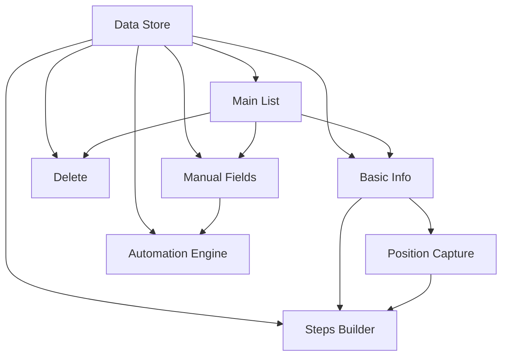

# Cronos

## 1. Executive Summary

Cronos is a Windows desktop automation app that lets users record and replay repetitive interactions with any other installed application — without modifying that application. Many desktop apps force users through the same manual sequence over and over: click the same button, type the same text, flip the same switch. Cronos eliminates that repetition by letting a user record a sequence of clicks, keystrokes, and typed text against the real screen positions of a target app, then replay that sequence on demand with a single click.

Cronos is built for power users, operations staff, and testers who repeat the same multi-step interaction inside a specific desktop application multiple times per day or week. The core value is turning a manual, error-prone, multi-minute click sequence into a one-click "action" that runs itself — including support for steps that still require human judgment at run time (a manual text field the user fills in right before execution).

At a high level, the user defines an "action": a name, the target application, the monitor it should run on, and an ordered list of steps (click, type, press key, or wait). Each positional step is captured by briefly opening the target app and letting the user click exactly where the action should happen, through a transparent full-screen overlay. Once saved, the action appears in the main list; clicking it (optionally filling any manual fields first) minimizes Cronos, brings the target app to the front on the right monitor, and replays every step with the configured delay between them.

## 2. Problem and Opportunity

### The Problem

- **Repetitive manual workflows.** Many desktop applications require the same exact sequence of clicks, typed values, and key presses to accomplish a routine task, forcing users to repeat 5-20+ manual interactions every time.
- **No automation without modifying the target app.** Most legacy or third-party Windows applications provide no scripting API, macro recorder, or plugin system, so users cannot automate anything without changing the app itself — which is often impossible (closed-source, no API) or risky.
- **Context-switching overhead.** Multi-monitor setups mean users must manually move, resize, and focus the target application on the correct screen every single time before they can even start the repetitive task.
- **Mixed manual/automatic steps break existing tools.** Generic macro recorders replay blindly; they cannot pause mid-sequence to let the user type a value that changes each run (e.g., a different order number, a different name), which is a common real-world need.

### The Opportunity

- Repetitive manual workflows → **F05/F08**: users record the sequence once as an ordered list of steps and replay it with one click, with a configurable delay between steps to match the target app's responsiveness.
- No automation without modifying the target app → **F04/F08**: Cronos operates purely from the outside, capturing absolute screen coordinates and simulating input (clicks, keystrokes, typed text) at the OS level, requiring zero integration with the target app.
- Context-switching overhead → **F08**: every execution automatically minimizes Cronos, opens or focuses the target app, and maximizes it on the exact monitor configured for that action, before any step runs.
- Mixed manual/automatic steps → **F07**: actions can mix pre-recorded automatic steps with manual fields that pause execution and let the user type a fresh value immediately before the automated sequence resumes.

## 3. Target Audience

### Primary Users

**Operations / Data-Entry User**

- Repeats the same data-entry sequence in a business application (ERP, CRM, internal tool) many times per day, often with one or two values that change each time (an ID, a name, an amount).
- Is not a developer and cannot write scripts, install browser extensions, or ask IT for an API integration.
- Values reliability over flexibility — wants an action that "just works" the same way every time it runs.

**QA / Test Engineer**

- Repeats the same manual test setup steps (login, navigate to a screen, fill a form, click through a wizard) before every manual test case, across multiple monitors.
- Comfortable configuring multi-step sequences and reordering/editing them as the tested app's UI evolves.
- Needs to re-run the exact same click positions across many test sessions without the target app moving between monitors.

### Behavioral Profile

- Works primarily on Windows with one or more external monitors.
- Interacts with a small, stable set of target applications (typically fewer than 10) rather than constantly automating new apps.
- Prefers a short one-time setup cost (recording the action) in exchange for large repeated time savings.
- Tolerates a brief interruption (the app minimizing, the target app opening) as the cost of a fully automated replay.

## 4. Objectives

- **Eliminate** repetitive manual interaction sequences in third-party apps by letting users record them once and replay them in one click.
  - *Metric*: An action with 10 steps and a 2s default delay completes execution in under `(10 × 2s) + 15s` (step delays plus app-open/focus overhead), measured from the "Execute" click to Cronos being restored on screen.
- **Guarantee** that recorded click positions remain accurate across replays on the same monitor configuration.
  - *Metric*: 100% of Click and Automatic-Digitar steps land within the exact recorded (x,y) coordinate when replayed on an unchanged monitor layout, verified across 20 consecutive executions of the same action.
- **Minimize** setup friction for creating a new action.
  - *Metric*: A user can create and save a 5-step action (2 clicks, 1 automatic type, 1 key press, 1 wait) in under 3 minutes on first use, without consulting external documentation.
- **Support** mixed manual/automatic workflows without breaking the automated flow.
  - *Metric*: 100% of actions containing at least one Manual-Digitar step correctly pause for field input before any automatic step executes, across all test scenarios.
- **Prevent** data loss when managing saved actions.
  - *Metric*: 0 unintended deletions — every delete requires an explicit confirmation dialog, and every save failure surfaces an error toast without silently discarding the user's in-progress action.

## 5. User Stories

### F01. Actions Data Store

- As the system, I want to persist every saved action (name, monitor, target app, default delay, ordered steps) to a local JSON file so that actions survive an app restart
- As the system, I want to load all saved actions on startup so that the main screen can display them immediately
- As the system, I want to reject a corrupted or unreadable data file gracefully so that the app still starts instead of crashing

### F02. Main Screen — Actions List

- As a user, I want to see a list of all my saved actions with their name, target app, and step count so that I can identify the right one at a glance
- As a user, I want to click an action's name so that I am taken to the Execute Action screen for that action
- As a user, I want to click "Add new action" so that I am taken to the Add Action wizard
- As a user, I want to click an edit button on an action so that I can modify it without recreating it from scratch
- As a user, I want to see a success toast after creating, editing, or deleting an action so that I know the change was saved

### F03. Add/Edit Action — Basic Info

- As a user, I want to enter a name for my new action so that I can identify it later
- As a user, I want to choose which monitor the action should run on, but only when more than one monitor is detected, so that I'm not shown an irrelevant choice on a single-monitor setup
- As a user, I want to choose which installed application this action targets so that Cronos knows what to open before running steps
- As a user, I want to confirm this basic info and move to the steps configuration so that I can start building the sequence

### F04. Screen Position Capture

- As a user, I want Cronos to minimize itself, open my target app maximized on the chosen monitor, and show a transparent overlay so that I can click exactly where the step should happen
- As a user, I want my click on the overlay to save that exact screen position and return me to Cronos with the step added so that I don't have to manually enter coordinates
- As a user, I want to press ESC during the overlay so that I can cancel the capture and return to Cronos without adding or changing the step
- As a user, I want to redo a step's captured position later so that I can fix it if the target app's layout changes, without deleting and recreating the whole step

### F05. Add/Edit Action — Steps Builder

- As a user, I want to add a Click step and immediately be sent through the position-capture flow so that the click target is recorded
- As a user, I want to add an Automatic-Digitar step with pre-set text and a captured position so that Cronos types that exact text at that exact spot every run
- As a user, I want to add a Pressionar step by picking a key (optionally with modifiers) from a list so that Cronos simulates that exact key combination
- As a user, I want to add an Esperar step with a number of seconds so that Cronos pauses before continuing
- As a user, I want to add a Manual-Digitar step with a field label so that I'm prompted to type a fresh value every time I execute the action
- As a user, I want to edit an existing step's fields without being forced to recapture its position so that small text changes are fast
- As a user, I want to remove a step so that I can correct mistakes
- As a user, I want to drag and drop steps to reorder them so that the execution sequence matches what I need
- As a user, I want the Save button to stay disabled until at least one step exists so that I can't save an empty action
- As a user, I want to set a default delay (in seconds) applied between every step so that Cronos waits long enough for the target app to respond

### F06. Delete Action

- As a user, I want to click delete on an action and see a confirmation dialog naming that action so that I don't accidentally lose it
- As a user, I want to confirm the deletion so that the action and all its steps are permanently removed

### F07. Execute Action — Manual Fields

- As a user, I want Cronos to check whether my action has any Manual-Digitar steps as soon as I open it for execution so that I only see the manual-fields screen when it's actually needed
- As a user, I want to see one input per Manual-Digitar step, labeled clearly, so that I know what to type before execution starts
- As a user, I want the Execute button to be enabled only once all manual fields are filled so that automatic steps never run with a missing value
- As the system, I want to skip straight to execution when an action has no manual steps so that fully automatic actions run with a single click

### F08. Execute Action — Automation Engine

- As the system, I want to minimize the Cronos window before doing anything else so that it doesn't block the target app
- As the system, I want to open the target app (or focus it if already running) and maximize it on the action's configured monitor so that every step lands on the right screen
- As the system, I want to execute each step in saved order, waiting the configured default delay between steps, so that the replay matches the timing needed by the target app
- As the system, I want to simulate a mouse click at a step's recorded coordinate for Click and Automatic-Digitar steps so that the target app receives the interaction
- As the system, I want to simulate typing the step's text (pre-set or manually entered) so that the target app receives the exact characters
- As the system, I want to simulate the configured key combination for Pressionar steps so that the target app receives the correct key event
- As the system, I want to cancel the whole execution and show an error toast if the target app cannot be opened or focused so that steps never run against the wrong window
- As a user, I want Cronos to restore itself on screen and show a success toast after the last step finishes so that I know the action completed
- As a user, I want to be returned to the main screen after a successful execution so that I can run the next action immediately

## 6. Functionalities

### F01. Actions Data Store

**Provides:**

- Saved action records — id, name, monitor id and bounds, target app path/icon path/name, default delay, ordered step list with per-step type-specific fields and captured coordinates (used by F02, F03, F05, F06, F07, F08)

**Capabilities:**

- Stored as a single JSON file inside Electron's `userData` directory (e.g. `actions.json`), owned and read/written exclusively by the main process, exposed to the renderer via IPC (`actions:list`, `actions:get`, `actions:save`, `actions:delete`).
- Each action record includes: id (UUID), name (1-60 chars), monitor id + bounds (always stored, even when only 1 monitor exists), target app (name, path, icon path), default delay in seconds (0.5-30, default 2), and an ordered array of up to 50 steps.
- Each step record includes: id, type (`click` | `auto-type` | `press-key` | `wait` | `manual-type`), and type-specific fields (coordinate for `click`/`auto-type`; text 1-500 chars for `auto-type`; key + modifiers for `press-key`; seconds 1-60 for `wait`; label 1-40 chars + optional placeholder up to 100 chars for `manual-type`).
- Writes are atomic (write to a temp file, then rename) to avoid a corrupted file on a crash mid-write.

**Experience:**

- On app startup, the main process reads the JSON file and holds the parsed actions in memory; all renderer reads go through IPC against this in-memory store, refreshed on every write.
- If the file does not exist yet (first run), an empty actions list is created and persisted.

**Error Handling:**

- File does not exist on first run → treated as an empty list, not an error; a new file is created silently.
- File exists but contains invalid/corrupted JSON → the app still starts with an empty in-memory list, and a toast is shown: "Não foi possível carregar suas ações salvas. Um novo arquivo será criado ao salvar a próxima ação." The corrupted file is renamed with a `.bak` suffix instead of being overwritten immediately, so no data is silently destroyed.
- Write to disk fails (e.g., disk full, permission denied) → the in-memory state is not updated, the caller (F05/F06) receives a failure and shows an error toast: "Não foi possível salvar as alterações. Tente novamente."
- Concurrent write race (two saves in flight) → writes are serialized through a single queue in the main process so the last completed write always wins; no partial merges.

### F02. Main Screen — Actions List

**Consumes:**

- F01: saved action records (name, target app, step count) for list rendering; full action record when an edit or execute is triggered

**Provides:**

- Selected action id and full record for editing (used by F03)
- Selected action id for execution (used by F07)
- Selected action id for deletion (used by F06)

**Capabilities:**

- List shows every saved action as a row with: action name, target app name (with icon when available), and step count (e.g., "6 passos").
- List is sorted by most recently created first; a search/filter input narrows the list by action name (same filtering pattern already used for the app list).
- "Adicionar ação" button is always visible at the top of the screen.
- Each row has: the clickable name/row area (opens Execute Action), an edit icon button, and a delete icon button.

**Experience:**

- Empty state (no actions saved yet) shows a message ("Nenhuma ação criada ainda.") and highlights the "Adicionar ação" button.
- Clicking anywhere on a row except the edit/delete icons navigates to the Execute Action screen (F07) for that action.
- Clicking the edit icon navigates to the Add/Edit Action wizard (F03) pre-filled with that action's data.
- Clicking the delete icon opens the confirmation flow (F06).
- A success toast appears at the bottom of the screen for 2.5 seconds after returning from a successful create, edit, delete, or execution, with a message specific to the action performed (e.g., "Ação 'Preencher relatório' criada com sucesso.", "Ação excluída com sucesso.", "Ação 'Preencher relatório' executada com sucesso.").

### F03. Add/Edit Action — Basic Info

**Consumes:**

- F01: existing action record (name, monitor id, target app) when opened in edit mode, to pre-fill the form
- F02: selected action id, indicating edit mode and which record to load

**Provides:**

- Draft action basic info — name, monitor id/bounds, target app (name/path/icon path) (used by F05)

**Capabilities:**

- Name field: required, 1-60 characters, trimmed of leading/trailing whitespace.
- Monitor selector: only rendered when more than 1 monitor is detected (reusing the existing monitor enumeration); when exactly 1 monitor exists, that monitor's id/bounds are still recorded on the draft automatically, without showing a selector.
- App selector: reuses the existing installed-app listing, with the same search/filter behavior already used on the main app list; exactly one app must be selected.
- "Confirmar" button is disabled until name is non-empty, an app is selected, and (when applicable) a monitor is selected.

**Experience:**

- In create mode, all fields start empty (monitor defaults to the single available monitor when there's only one).
- In edit mode, all fields are pre-filled from the existing action; changing the target app or monitor here does not retroactively invalidate previously captured step positions (a warning banner is shown: "Alterar o app ou monitor pode fazer com que posições já capturadas fiquem incorretas.").
- Confirming advances to the Steps Builder (F05) carrying the draft's name, monitor, and app forward; canceling returns to the main screen without saving anything.

### F04. Screen Position Capture

**Consumes:**

- F03: draft's target app and monitor selection, to know what to open and where

**Provides:**

- Captured absolute screen coordinate (x, y) for a step (used by F05)

**Core Scope:**

- Minimize Cronos, open/focus the target app maximized on the selected monitor, display a full-screen transparent overlay window on that monitor, capture the next left-click's absolute coordinate, close the overlay, restore Cronos with the step added.
- ESC cancels the capture at any point before the click, closing the overlay and restoring Cronos without adding or modifying the step.

**Full Scope additions:**

- "Redo position" action on an existing Click/Automatic-Digitar step, re-running the same capture flow to overwrite just that step's coordinate without deleting and recreating the step.

**Capabilities:**

- The overlay is a borderless, always-on-top, click-through-disabled window sized exactly to the selected monitor's bounds, rendered with a subtle semi-transparent tint (~15% black) and a crosshair cursor, so the user can see the target app underneath while capturing.
- The overlay reuses the existing app-open/focus logic (`apps:open`, up to 10 focus attempts at 500ms intervals, ~5s timeout, plus 4 re-assertions at 400ms to win any race with the target app's own window restoration) before becoming interactive.
- Only a single left-click is captured per invocation; the coordinate is stored relative to the selected monitor's origin (so it stays valid if the monitor's absolute position in the OS layout changes, as long as its resolution/DPI doesn't).

**Experience:**

- While the target app is being opened/focused, the overlay shows a brief loading indicator ("Abrindo [app]...") before becoming clickable.
- Immediately after a successful click, Cronos is restored to the foreground with the new/updated step visible and highlighted in the steps list.
- If the target app fails to open (see F08 error handling for the shared open/focus logic), the capture is aborted, Cronos is restored, and an error toast is shown instead of opening the overlay: "Não foi possível abrir [app] para capturar a posição."

### F05. Add/Edit Action — Steps Builder

**Consumes:**

- F01: existing action's step list and default delay, when editing (to pre-fill the steps builder)
- F03: draft basic info (name, monitor, target app)
- F04: captured coordinate for Click and Automatic-Digitar steps

**Provides:**

- Complete ordered step list and default delay (used by F01 for persistence)

**Capabilities:**

- Default delay field: numeric, 0.5-30 seconds, defaults to 2, applied uniformly between every consecutive pair of steps during execution (no per-step override).
- "Adicionar passo" button opens a type picker with the 5 step types grouped under "Automático" (Click, Digitar, Pressionar, Esperar) and "Manual" (Digitar).
- Click / Automatic-Digitar: adding or editing the position triggers the F04 capture flow; Automatic-Digitar additionally requires text (1-500 characters) entered in a text field before/after capture.
- Pressionar: key chosen from a predefined list (Enter, Tab, Esc, Backspace, Delete, Espaço, setas, Home, End, Page Up/Down) with optional modifiers (Ctrl, Alt, Shift, up to all three combined), no position required.
- Esperar: integer seconds, 1-60, no position required.
- Manual-Digitar: field label (1-40 characters) and optional placeholder text (up to 100 characters), no position required.
- Steps list supports edit (opens the same fields used at creation, without re-triggering F04 unless the user explicitly chooses "Refazer posição"), remove (immediate, no confirmation — recoverable by re-adding), and drag-and-drop reordering.
- "Salvar" button is disabled until at least 1 step exists; also disabled while the basic info from F03 is incomplete.

**Experience:**

- The steps list renders each step with an icon per type, a short summary (e.g., "Click em (512, 340)", "Digitar: \"relatorio_final\"", "Pressionar: Ctrl+S", "Esperar 3s", "Manual: Nome do cliente"), and per-row edit/remove/drag controls.
- Reordering via drag-and-drop shows a live insertion indicator between rows as the user drags.
- Saving writes the full action (basic info + steps + default delay) to F01 and returns to the main screen (F02) with a success toast.

**Error Handling:**

- Save fails at the persistence layer (F01 write error) → the wizard stays open with the user's in-progress data intact, and an error toast is shown: "Não foi possível salvar a ação. Tente novamente."
- User attempts to save with 0 steps → the Save button remains disabled and, if clicked via keyboard shortcut, a message is shown: "Adicione pelo menos 1 passo antes de salvar."
- User navigates away (back/close) with unsaved changes → a confirmation dialog asks whether to discard changes, so in-progress work is never lost silently.

### F06. Delete Action

**Consumes:**

- F02: selected action id
- F01: existing action record (name, to display in the confirmation dialog)

**Capabilities:**

- Deletion is permanent and immediate once confirmed; there is no undo/trash.

**Experience:**

- Clicking the delete icon on a row opens a confirmation dialog: "Excluir a ação '[nome]'? Essa ação não pode ser desfeita." with "Cancelar" and "Excluir" buttons.
- Confirming removes the action from the data store and the main list immediately, with a success toast: "Ação '[nome]' excluída com sucesso."
- Canceling closes the dialog with no changes.

**Error Handling:**

- Deletion fails at the persistence layer (F01 write error) → the action remains visible in the list, the dialog closes, and an error toast is shown: "Não foi possível excluir a ação. Tente novamente."

### F07. Execute Action — Manual Fields

**Consumes:**

- F01: saved action's step list (to detect any `manual-type` steps and their labels/placeholders)
- F02: selected action id

**Provides:**

- Filled-in manual field values, one per Manual-Digitar step, keyed by step id (used by F08)

**Capabilities:**

- One text input per Manual-Digitar step in the action, in step order, each labeled with that step's configured label and showing its placeholder when empty.
- Fields always start empty on every execution (values are not remembered between runs).
- "Executar" button is disabled until every manual field has a non-empty value.

**Experience:**

- If the action has zero Manual-Digitar steps, this screen is skipped entirely and the flow goes straight to F08.
- If the action has one or more Manual-Digitar steps, this screen is shown first; clicking "Executar" carries the filled values into F08 and begins execution immediately.
- A "Cancelar" action returns to the main screen without executing anything.

### F08. Execute Action — Automation Engine

**Consumes:**

- F01: saved action's target app, monitor, ordered step list, and default delay
- F07: filled-in manual field values (used only for `manual-type` steps; empty map when the action has none)

**Capabilities:**

- Execution order is fixed: (1) minimize Cronos, (2) open the target app or focus it if already running, maximized on the action's configured monitor (reusing the existing `apps:open`/focus logic and its retry behavior), (3) run each step in saved order, waiting the action's default delay before each step after the first, (4) restore Cronos and show the success toast.
- Click / Automatic-Digitar steps simulate a left mouse click at the step's recorded absolute coordinate (translated into the current position of the action's configured monitor).
- Automatic-Digitar and Manual-Digitar steps simulate typing the associated text (pre-set or user-entered) as a sequence of character input events.
- Pressionar steps simulate the configured key plus any modifiers as a single key-down/key-up event sequence.
- Esperar steps simply pause for their configured seconds in addition to the default delay.
- The whole run is Windows-only in this version, consistent with the existing window-placement implementation.

**Experience:**

- While executing, Cronos remains minimized; there is no visible progress UI in the target app beyond the simulated interactions themselves.
- On completion of the last step, Cronos is restored to the foreground, a success toast is shown ("Ação '[nome]' executada com sucesso."), and the user is returned to the main screen.

**Error Handling:**

- Target app cannot be opened at all (executable/shortcut missing or fails to launch) → execution is cancelled before any step runs, Cronos is restored, and an error toast is shown: "Não foi possível abrir [app]."
- Target app opens but its window cannot be found/focused within the retry window (~5s + reassertions) → execution is cancelled before any step runs, Cronos is restored, and an error toast is shown: "Não foi possível encontrar a janela de [app]."
- A step fails mid-sequence (e.g., the simulated input call itself errors at the OS level) → execution stops immediately at that step (no further steps run), Cronos is restored, and an error toast is shown: "A execução foi interrompida no passo [n]: [tipo do passo]."
- Selected monitor from the action's saved configuration no longer exists (e.g., monitor unplugged since the action was created) → execution is cancelled before opening the target app, Cronos stays visible, and an error toast is shown: "O monitor configurado para esta ação não foi encontrado. Edite a ação para selecionar outro monitor."

## 7. Out of Scope

**Automation capabilities**

- Recording/replaying drag gestures, scroll wheel input, or multi-touch gestures.
- Conditional logic, branching, or loops within an action (if/else, repeat N times).
- Variables, dynamic text, or data interpolation in Automatic-Digitar text (e.g., pulling values from a file or clipboard).
- Screen-content recognition (image matching, OCR) to locate elements when the UI moves; positions are purely fixed absolute coordinates.

**Platform and environment**

- macOS and Linux support for click/keystroke/typing simulation (window listing/opening remains available cross-platform via existing base capabilities, but new automation steps in this PRD are Windows-only).
- Running actions unattended/headless, on a schedule, or triggered by an external event (e.g., file change, hotkey while Cronos is closed).
- Multi-machine or cloud sync of saved actions; all data is local to the machine.

**Collaboration and sharing**

- Exporting, importing, or sharing actions between users or machines.
- Multi-user accounts, permissions, or profiles within the same installation.

**Reliability and resilience**

- Automatic re-detection or self-healing of stale click positions after a target app's UI changes (the user must manually use "Redo position").
- Retrying a failed step automatically; a failure stops the whole execution as described in F08.
- Undo/trash for deleted actions.

## 8. Dependency Graph

### Part 1: Dependency Table

| #   | Feature                          | Priority | Dependencies |
| --- | --------------------------------- | -------- | ------------- |
| F01 | Actions Data Store                 | 1        | None          |
| F02 | Main Screen — Actions List         | 1        | F01           |
| F03 | Add/Edit Action — Basic Info       | 1        | F01, F02      |
| F04 | Screen Position Capture            | 1        | F03           |
| F05 | Add/Edit Action — Steps Builder    | 1        | F01, F03, F04 |
| F06 | Delete Action                      | 2        | F01, F02      |
| F07 | Execute Action — Manual Fields     | 1        | F01, F02      |
| F08 | Execute Action — Automation Engine | 1        | F01, F07      |

### Foundation Features

These features set up shared project infrastructure. In a greenfield project they must be implemented sequentially before or alongside any feature that depends on them:

- **F01 Actions Data Store** — establishes the persistence layer (JSON file in `userData`, IPC read/write contract) that every other feature reads from or writes to.

### Execution Waves

Features within the same wave can be built in parallel. A wave starts only after every feature in earlier waves is complete.

**Note:** Foundation features (see "Foundation Features" above) cannot run in parallel in a greenfield project even if they appear together in a wave — they share scaffolding files and must be implemented sequentially until the base is in place.

- **Wave 1**: F01
- **Wave 2**: F02
- **Wave 3**: F03, F07, F06
- **Wave 4**: F04, F08
- **Wave 5**: F05

### Priority levels

- **1** = Essential — product does not work without it
- **2** = Important — significant value addition
- **3** = Desirable — incremental improvement

## 9. Acceptance Criteria

### F01. Actions Data Store

- [ ] On first launch with no existing data file, the app starts with an empty actions list and creates the file without error
- [ ] Saving an action persists it to the JSON file such that it is still present after fully restarting the app
- [ ] An action with only 1 monitor available still has monitor id and bounds recorded in its saved record
- [ ] If the data file is corrupted, the app still starts (empty list) and shows the corrupted-data toast instead of crashing
- [ ] A write failure surfaces a failure result to the caller without corrupting the previously saved data

### F02. Main Screen — Actions List

- [ ] Each row displays the action's name, target app name, and step count
- [ ] Clicking an action's name/row navigates to the Execute Action screen for that action
- [ ] Clicking "Adicionar ação" navigates to the Add Action wizard, Step 1
- [ ] Clicking a row's edit icon navigates to the wizard pre-filled with that action's data
- [ ] A success toast appears after returning from a successful create, edit, delete, or execution

### F03. Add/Edit Action — Basic Info

- [ ] The monitor selector is hidden when exactly 1 monitor is detected, and shown when 2 or more are detected
- [ ] "Confirmar" stays disabled until name, app, and (when applicable) monitor are all set
- [ ] In edit mode, all fields are pre-filled from the existing action's saved data
- [ ] Confirming advances to the Steps Builder carrying the entered name, monitor, and app forward

### F04. Screen Position Capture

- [ ] Starting a capture minimizes Cronos, opens/focuses the target app maximized on the selected monitor, and shows the transparent overlay
- [ ] Clicking on the overlay saves the exact absolute coordinate and returns to Cronos with the step added/updated
- [ ] Pressing ESC during the overlay cancels the capture and returns to Cronos without adding or changing the step
- [ ] Using "Redo position" on an existing step overwrites only that step's coordinate, leaving its other fields untouched

### F05. Add/Edit Action — Steps Builder

- [ ] "Salvar" is disabled when the steps list is empty and becomes enabled once at least 1 step is added
- [ ] Adding a Click or Automatic-Digitar step triggers the position-capture flow and stores the resulting coordinate on the step
- [ ] Adding a Pressionar step without going through position capture is possible and stores the selected key/modifiers
- [ ] Editing a step's non-position fields does not re-trigger the position-capture flow
- [ ] Removing a step removes it from the list immediately
- [ ] Dragging a step to a new position updates the saved step order accordingly
- [ ] Saving with a persistence failure keeps the wizard open with the user's data intact and shows an error toast

### F06. Delete Action

- [ ] Clicking delete opens a confirmation dialog naming the specific action
- [ ] Confirming removes the action from both the list and the data store, and shows a success toast
- [ ] Canceling the dialog leaves the action unchanged in the list

### F07. Execute Action — Manual Fields

- [ ] Opening an action with zero Manual-Digitar steps skips directly to execution
- [ ] Opening an action with one or more Manual-Digitar steps shows one labeled input per such step, all starting empty
- [ ] "Executar" stays disabled until every manual field has a non-empty value
- [ ] Confirming with all fields filled proceeds to execution carrying the entered values

### F08. Execute Action — Automation Engine

- [ ] Execution always minimizes Cronos before performing any other action
- [ ] The target app is opened or focused and maximized on the action's configured monitor before any step runs
- [ ] Steps execute in their saved order, with the action's default delay observed between consecutive steps
- [ ] A Click/Automatic-Digitar step simulates a click at the exact recorded coordinate
- [ ] A Pressionar step simulates the exact configured key/modifier combination
- [ ] A failure to open/focus the target app cancels execution before any step runs, restores Cronos, and shows an error toast
- [ ] A mid-sequence step failure stops all remaining steps, restores Cronos, and shows an error toast naming the failed step
- [ ] Successful completion of the last step restores Cronos, shows a success toast, and returns to the main screen

### Cross-Feature Integration

- [ ] An action created via F03/F05 and persisted by F01 appears correctly in the F02 list with the right name, target app, and step count
- [ ] An action opened for editing via F02's edit action (F03) is pre-filled exactly from that action's stored record in F01, including name, monitor, and target app
- [ ] Editing an existing action (F05) correctly loads and displays its previously saved steps and default delay from F01 before any change is made
- [ ] A coordinate captured by F04 is stored on the correct step by F05 and is exactly what F08 uses when simulating the click during execution
- [ ] The target app and monitor selected in F03 are exactly what F04 opens/focuses during capture and what F08 opens/focuses during execution
- [ ] An action's step list loaded from F01 correctly determines whether F07's manual-fields screen is shown or skipped before F08 executes
- [ ] Manual field values collected in F07 are correctly applied to the corresponding `manual-type` steps when F08 executes them
- [ ] Deleting an action selected via F02 (F06) removes it from F01's store such that it no longer appears in F02's list
